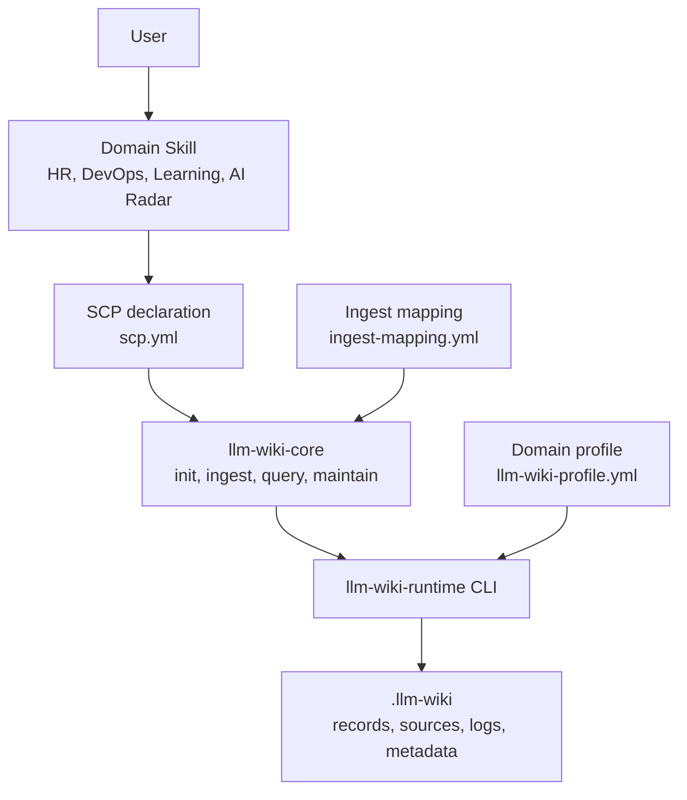

# llm-wiki-runtime

English | [简体中文](README.zh-CN.md)

`llm-wiki-runtime` is a deterministic local knowledge runtime for Agent Skills and copilots. It gives domain-specific Skills a shared way to initialize local knowledge stores, import durable evidence, load bounded context, and maintain references without embedding storage logic in every Skill.

The project is designed primarily for Skill and Agent developers. End users continue to work through their existing domain Skills and do not need to learn the runtime CLI.

## Why This Project Exists

Domain Skills often produce knowledge that should survive a single conversation: job descriptions, candidate history, deployment records, learning notes, research findings, and other reusable evidence. Building persistence independently in every Skill leads to inconsistent paths, unsafe writes, duplicated indexes, and incompatible context formats.

`llm-wiki-runtime` separates those concerns:

- Domain Skills own business meaning and decide what is worth keeping.
- `llm-wiki-core` owns Agent-side intent routing and workflow orchestration.
- `llm-wiki-runtime` owns deterministic access, validation, references, and local storage safety.
- SCP, the Skill Context Protocol, declares how a Skill participates without coupling the runtime to a specific domain.

## Core Principles

1. **Domain owns meaning; runtime owns access.** The runtime never invents HR, DevOps, learning, or research semantics.
2. **The Wiki is an optional backend.** Missing, disabled, or unhealthy runtime state must not break the original Skill workflow.
3. **Initialization is domain-scoped.** A domain is initialized once per scope; its child Skills share the same knowledge store.
4. **Read before work, write after work.** Enabled Skills load narrow context before execution and ingest durable results afterward.
5. **Evidence stays traceable.** Records cite controlled sources, immutable versions, checksums, and append-only events.
6. **Cross-domain access is read-only in V0.1.** A Skill writes only to its primary domain.

## Architecture



The integration uses three contracts:

| Contract | Owner | Purpose |
| --- | --- | --- |
| `scp.yml` | Business Skill | Declares domain, profile, trust, query dependencies, and allowed products |
| `llm-wiki-profile.yml` | Domain package | Defines directories, record paths, write modes, references, and context rules |
| Runtime CLI | `llm-wiki-runtime` | Performs deterministic configuration, validation, reads, and writes |

## Current Capabilities

V0.1 provides:

- Home and project-local scope discovery
- Domain profile snapshots
- Path-boundary validation
- Scope locks and atomic file writes
- Source registries with checksums and controlled provenance
- Create-only, update-allowed, and append-only records
- Artifact indexes and append-only logs
- Deterministic context packs with path and glob filters
- SCP discovery and registry generation
- Ingest mapping validation
- Cross-domain read policy
- `data_only` isolation metadata for untrusted supporting context
- Retry-safe source, record, and event operations
- Structured JSON CLI responses and explicit fallback statuses

## Installation

### Prerequisites

- Node.js 18 or newer for the [Skills CLI](https://github.com/vercel-labs/skills)
- Python 3.10 or newer for the runtime
- Git for installing the runtime from GitHub

### Install the Core Skill

Let the Skills CLI detect your installed Agent:

```bash
npx skills add huajiexiewenfeng/llm-wiki-runtime --skill llm-wiki-core --global
```

Install for a specific Agent:

```bash
# Codex
npx skills add huajiexiewenfeng/llm-wiki-runtime --skill llm-wiki-core --global --agent codex

# Claude Code
npx skills add huajiexiewenfeng/llm-wiki-runtime --skill llm-wiki-core --global --agent claude-code
```

Inspect the repository before installing:

```bash
npx skills add huajiexiewenfeng/llm-wiki-runtime --list
```

The repository exposes one installable parent Skill, `llm-wiki-core`. Its `init`, `ingest`, `query`, and `maintain` child workflows are included inside that package.

### First Runtime Activation

Installing the Agent Skill does not silently install Python packages. When a user first enables a domain Wiki, `llm-wiki-init` checks `llm-wiki version` and asks for confirmation before installing the runtime from GitHub.

Manual fallback:

```bash
python -m pip install "git+https://github.com/huajiexiewenfeng/llm-wiki-runtime.git"
llm-wiki version
```

Expected response:

```json
{"status":"ok","version":"0.3.0"}
```

## How Users Experience It

A conforming Domain Skill keeps the first interaction focused on the business task:

```text
Run the original business workflow
  -> return the result
  -> offer local knowledge only when reusable data exists
  -> install and initialize after confirmation
  -> preview the current data
  -> ingest only after confirmation
```

After the domain is enabled, each invocation follows:

```text
resolve-config
  -> preflight query with narrow filters
  -> original business workflow
  -> postflight durable-data decision
  -> ingest through the runtime
  -> return the result with context references
```

Users interact in natural language. They do not need to edit YAML, create directories, or compose CLI commands.

## Core Skills

| Skill | Responsibility |
| --- | --- |
| `llm-wiki-init` | Verify runtime availability, resolve a domain scope, obtain confirmation, and initialize its profile |
| `llm-wiki-ingest` | Validate a domain mapping, preview evidence, and perform retry-safe source, record, and log writes |
| `llm-wiki-query` | Resolve the primary domain, load narrow context packs, and isolate supporting domains |
| `llm-wiki-maintain` | Scan SCP declarations and diagnose profile, mapping, trust, and configuration health |

The parent `llm-wiki-core` Skill is an intent router. It selects exactly one child workflow and does not write Wiki files itself.

## Integrating a Domain Skill

A domain package normally contributes:

```text
my-domain-copilot/
  llm-wiki-profile.yml
  ingest-mapping.yml
  my-business-skill/
    SKILL.md
    scp.yml
```

Integration is not complete after adding declarations. Each business `SKILL.md` must also implement:

- Optional runtime detection and fallback
- Preflight `query` when the domain is enabled
- The unchanged original business workflow
- Postflight `ingest` for durable, domain-owned data
- Preview and confirmation gates for sensitive or identity-changing writes

Use the [5-minute Domain Skill integration guide](docs/guides/domain-skill-integration-quickstart.zh.md) for the complete LLM-executed workflow and human acceptance steps.

## Skill and Workload Entry Modes (0.3)

Choose the Principal topology before copying contracts:

| Mode | Runtime caller | Reference |
| --- | --- | --- |
| Skill-only | Domain Skill registered through SCP | HR compatibility example |
| Harness-only | Independent `workload/domain_harness` | Observatory Harness |
| Skill+Harness | Separate Skill and Harness Principals in one Domain | Complete Observatory example |

Use the [Skill + Harness Runtime 0.3 integration manual](docs/guides/skill-harness-llm-wiki-runtime-integration.zh.md) for the LLM-executed assessment and implementation workflow.

Existing Skills keep the compatible SCP flow: publish `scp.yml`, then an
operator or maintain workflow runs `scan-scp --scp-path-json ... --write` to
refresh the Skill entries. A `principal.yml` is for a governed Workload (for
example, a domain harness), which is registered explicitly:

```yaml
principal_version: v0.1
principal:
  id: research-harness
  kind: workload
  role: domain_harness
  domain: research
llm_wiki:
  profile: research
  fallback_mode: evidence_only
query:
  primary_domain: research
  supports: []
ingest:
  produces:
    - domain: research
      record_type: research_note
```

```powershell
llm-wiki register-principal --manifest .\principal.yml --registry-path .\principal-registry.json
llm-wiki scan-scp --scp-path-json '[".\\my-skill\\scp.yml"]' --write --output .\principal-registry.json
```

The Registry's top-level `skills` value is a deterministic, read-only
projection of `principals` filtered to `kind: skill`; it is not a second
authorization source and must not be edited independently. `scan-scp --write`
refreshes SCP-origin Skills while preserving registered Workloads.

`principal.id` is a protocol identity used for contract and audit binding. It
is not a password, certificate, signing key, or claim of cryptographic identity.

New Workloads use one Principal-aware `invoke` envelope. This complete Query
example requests an exact record lookup from an already initialized absolute
workspace:

```json
{
  "protocol_version": "v0.1",
  "request_id": "req-query-001",
  "principal_id": "research-harness",
  "operation": "find_records",
  "scope_root": "C:\\work\\research-project",
  "payload": {
    "record_type": "research_note",
    "lookup_value": "note-001"
  }
}
```

```powershell
llm-wiki invoke --request .\request.query.json --registry-path .\principal-registry.json --profile-path .\llm-wiki-profile.yml
```

This complete write example binds the Workload, active Profile, and v0.2
Mapping before calling the existing deterministic write core:

```json
{
  "protocol_version": "v0.1",
  "request_id": "req-write-001",
  "principal_id": "research-harness",
  "operation": "write_record",
  "scope_root": "C:\\work\\research-project",
  "mapping_id": "research-note-import",
  "payload": {
    "record_type": "research_note",
    "variables": {"record_id": "note-001"},
    "refs": {"source_id": "source-001"},
    "content_file": "C:\\work\\research-project\\prepared-note.md"
  }
}
```

```powershell
llm-wiki invoke --request .\request.write.json --registry-path .\principal-registry.json --profile-path .\llm-wiki-profile.yml --mapping-path .\ingest-mapping.yml
```

If a Workload Invocation fails, it must not silently fall back to legacy write
commands. Legacy CLI commands remain available only for Skill/operator
compatibility and cannot claim Workload authorization. Runtime 0.2 records
that completed remain readable; pending approvals created under an older
contract are stale and must be revalidated before writing.

## CLI Surface

The CLI is an execution contract for Skills, not the primary end-user interface.

| Area | Commands |
| --- | --- |
| Runtime and configuration | `version`, `resolve-config`, `init-home`, `init-profile` |
| Durable writes | `copy-source`, `write-record`, `register-artifact`, `append-log` |
| Context reads | `find-records`, `load-context-pack` |
| Ingest preparation | `prepare-excerpt` |
| Contracts and discovery | `validate-mapping`, `scan-scp`, `register-principal` |
| Offline graph views | `graph-export` |

`find-records` performs only declared exact matches against frontmatter fields.
It does not search Markdown bodies or depend on Graph output.

Every command returns a structured JSON envelope with `status`, `warnings`, `next_actions`, and `context_refs` where applicable.

## Storage Layout

An initialized scope uses a predictable layout:

```text
.llm-wiki/
  .meta/
    profile.yml
    graph/
      index.html
      graph-manifest.json
      graph-export-report.json
      <domain>/
        graph.html
        graph.json
  domains/
    <domain>/
  sources/
    originals/
    registry.json
  artifacts/
    index.json
  logs/
```

Domain profiles own the paths below `domains/<domain>/`. Runtime metadata stays under `.meta`, and raw sources are excluded from context packs by default.

`llm-wiki graph-export --cwd <scope>` creates one self-contained, offline HTML page per discovered Domain and a shared index under `.llm-wiki/.meta/graph/`. The export uses only scope snapshots and explicit evidence-backed relationships; it does not infer cross-Domain edges. See [Offline graph export](docs/guides/graph-export.zh.md).

## Safety, Privacy, and Trust

- Writes are constrained to the resolved Wiki root.
- Shared indexes and logs use locks and atomic replacement.
- Required `source_id` references must exist in the source registry.
- Immutable versions use create-only writes and never overwrite different content.
- Raw sources and `.meta/**` are excluded from ordinary context packs.
- Supporting domains cannot write into the primary domain.
- External sources can be marked `external_untrusted` and `data_only`.
- Sensitive imports require a preview and explicit confirmation.
- Declined or disabled domains fall back without blocking the business Skill.

The runtime provides deterministic guardrails. It does not claim that an LLM is immune to malicious text; host prompts and domain usage policies remain part of the trust boundary.

## Status and Fallback

Important statuses include:

```text
ok
enabled
missing_config
disabled
profile_mismatch
domain_mapping_required
already_exists
validation_error
scope_busy
partial_failure
read_denied
runtime_unavailable
io_error
unexpected_error
principal_not_found
principal_conflict
principal_contract_stale
principal_kind_unsupported
principal_role_unsupported
principal_domain_mismatch
capability_denied
mapping_owner_mismatch
operation_not_allowed
invalid_invocation
```

`ok`, `enabled`, and `already_exists` are successful outcomes. Other statuses must follow the calling Domain Skill's documented fallback and must never be presented as successful writes.

## V0.1 Boundaries

V0.1 intentionally does not provide:

- A general autonomous Agent framework
- Vector search or semantic retrieval
- Cross-domain writes or automatic synchronization
- Cloud storage, team sharing, or a server control plane
- Automatic business semantics or entity resolution
- File watchers or background ingestion
- A guarantee that every third-party Skill is compatible

These boundaries keep the runtime small, deterministic, and replaceable.

## Examples and Documentation

### Examples

- [AI Research Observatory Skill+Harness reference](examples/ai-research-observatory/README.zh-CN.md)
- [HR profile](examples/hr/llm-wiki-profile.yml)
- [DevOps profile](examples/devops/llm-wiki-profile.yml)
- [HR SCP](examples/scp/hr-resume-screening.scp.yml)
- [Learning SCP](examples/scp/learning-companion.scp.yml)
- [AI Radar SCP](examples/scp/ai-radar.scp.yml)
- [Domain policies](examples/policies/domain-policies.v0.1.json)

### Guides

- [Skill + Harness Runtime 0.3 integration manual, Chinese](docs/guides/skill-harness-llm-wiki-runtime-integration.zh.md)
- [Domain Skill integration quickstart, Chinese](docs/guides/domain-skill-integration-quickstart.zh.md)
- [HR integration guide, Chinese](docs/guides/hr-llm-wiki-integration.zh.md)
- [HR implementation guide, Chinese](docs/guides/hr-skill-llm-wiki-runtime-implementation.zh.md)
- [Learning integration guide, Chinese](docs/guides/learning-llm-wiki-integration.zh.md)
- [SCP V0.1 design, Chinese](docs/superpowers/specs/2026-07-07-skill-context-protocol-v0-1-design.zh.md)

## Repository Layout

```text
llm_wiki_runtime/       Python runtime and CLI
skills/llm-wiki-core/  Agent Skill package
examples/               Profiles, SCP declarations, and policies
tests/                  Unit, contract, packaging, and end-to-end tests
docs/guides/            Integration guides
docs/superpowers/       Designs and implementation plans
```

## Development

```bash
git clone https://github.com/huajiexiewenfeng/llm-wiki-runtime.git
cd llm-wiki-runtime
python -m pip install -e .
python -m pytest -q
llm-wiki version
```

The runtime targets Python 3.10+ and has no third-party runtime dependencies.
