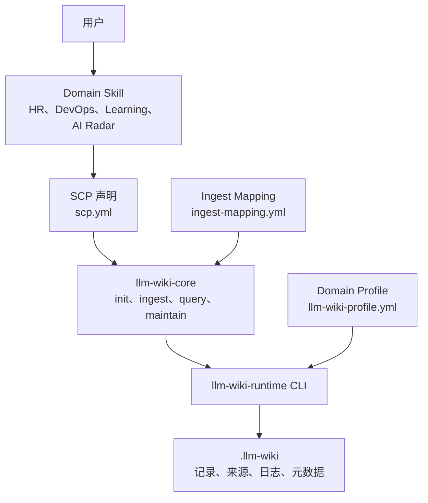

# llm-wiki-runtime

[English](README.md) | 简体中文

`llm-wiki-runtime` 是面向 Agent Skills 与 Copilot 的确定性本地知识运行时。它为不同领域 Skill 提供统一方式，用于初始化本地知识库、导入可追溯资料、加载受控上下文和维护引用，而不要求每个 Skill 重复实现存储逻辑。

本项目主要面向 Skill 与 Agent 开发者。普通用户仍然通过原有 Domain Skill 完成业务，不需要学习 runtime CLI。

## 为什么需要这个项目

Domain Skill 经常产生需要跨会话保留的知识，例如岗位 JD、候选人历史、部署记录、学习笔记、研究资料等。如果每个 Skill 独立实现持久化，就会出现路径不一致、写入不安全、索引重复和上下文格式互不兼容等问题。

`llm-wiki-runtime` 将这些职责拆开：

- Domain Skill 负责业务语义，并决定什么数据值得长期保存。
- `llm-wiki-core` 负责 Agent 侧的意图路由和流程编排。
- `llm-wiki-runtime` 负责确定性访问、校验、引用和本地存储安全。
- SCP（Skill Context Protocol）负责声明 Skill 如何参与，而不让 runtime 依赖某个具体领域。

## 核心原则

1. **Domain 负责语义，runtime 负责访问。** Runtime 不会发明 HR、DevOps、Learning 或 AI Radar 的业务含义。
2. **Wiki 是可选后端。** Runtime 缺失、禁用或异常时，不能破坏原有 Skill 流程。
3. **初始化属于 Domain scope。** 每个 Domain/scope 只初始化一次，其子 Skill 共用同一个知识库。
4. **业务前读取，业务后写入。** 已启用的 Skill 在执行前加载窄范围上下文，执行后写入有长期价值的结果。
5. **证据始终可追溯。** 记录引用受控来源、不可变版本、校验和与追加式事件。
6. **V0.1 的跨 Domain 能力只读。** Skill 只能写自己的 primary domain。

## 架构



接入由三份契约构成：

| 契约 | 所有者 | 用途 |
| --- | --- | --- |
| `scp.yml` | 业务 Skill | 声明 Domain、Profile、信任等级、查询依赖和允许产物 |
| `llm-wiki-profile.yml` | Domain 包 | 定义目录、记录路径、写入模式、引用和上下文规则 |
| Runtime CLI | `llm-wiki-runtime` | 执行确定性配置、校验、读取和写入 |

## 当前能力

V0.1 已提供：

- Home 与项目本地 scope 发现
- Domain Profile 快照
- 路径边界校验
- Scope 锁与原子文件写入
- 带校验和和受控 provenance 的来源注册表
- `create_only`、`update_allowed` 和 `append_only` 记录
- Artifact 索引与追加式日志
- 支持 path/glob 过滤的确定性 context pack
- SCP 发现与 registry 生成
- Ingest Mapping 校验
- 跨 Domain 读取策略
- 面向不可信 supporting context 的 `data_only` 隔离元数据
- 可安全重试的来源、记录和事件操作
- 结构化 JSON CLI 响应和明确的降级状态

## 安装

### 前置要求

- Node.js 18 或更高版本，用于运行 [Skills CLI](https://github.com/vercel-labs/skills)
- Python 3.10 或更高版本，用于运行 Runtime
- Git，用于从 GitHub 安装 Runtime

### 安装 Core Skill

让 Skills CLI 自动检测本机 Agent：

```bash
npx skills add huajiexiewenfeng/llm-wiki-runtime --skill llm-wiki-core --global
```

安装到指定 Agent：

```bash
# Codex
npx skills add huajiexiewenfeng/llm-wiki-runtime --skill llm-wiki-core --global --agent codex

# Claude Code
npx skills add huajiexiewenfeng/llm-wiki-runtime --skill llm-wiki-core --global --agent claude-code
```

安装前查看仓库中可用的 Skills：

```bash
npx skills add huajiexiewenfeng/llm-wiki-runtime --list
```

仓库对外暴露一个可安装父 Skill：`llm-wiki-core`。`init`、`ingest`、`query` 和 `maintain` 四个子流程包含在这个 Skill 包内部。

### 首次启用 Runtime

安装 Agent Skill 不会静默安装 Python 包。用户第一次启用某个 Domain Wiki 时，`llm-wiki-init` 会检查 `llm-wiki version`，并在从 GitHub 安装 Runtime 前取得用户确认。

手动回退安装方式：

```bash
python -m pip install "git+https://github.com/huajiexiewenfeng/llm-wiki-runtime.git"
llm-wiki version
```

预期响应：

```json
{"status":"ok","version":"0.2.0"}
```

## 用户实际体验

符合接入规范的 Domain Skill 会优先完成第一次业务任务：

```text
执行原业务流程
  → 返回业务结果
  → 仅在产生可复用数据时提示启用本地知识库
  → 用户确认后安装并初始化
  → 预览当前任务数据
  → 用户确认后才执行 ingest
```

Domain 启用后，每次调用执行：

```text
resolve-config
  → 使用窄范围过滤执行 preflight query
  → 执行原业务流程
  → postflight 判断长期数据
  → 通过 runtime ingest
  → 返回业务结果与 context_refs
```

用户只使用自然语言，不需要编辑 YAML、创建目录或拼接 CLI 命令。

## 四个 Core Skills

| Skill | 职责 |
| --- | --- |
| `llm-wiki-init` | 检查 Runtime、解析 Domain scope、取得确认并初始化 Profile |
| `llm-wiki-ingest` | 校验 Domain Mapping、预览证据并安全重试来源、记录与日志写入 |
| `llm-wiki-query` | 解析 primary domain、加载窄范围 context pack 并隔离 supporting domain |
| `llm-wiki-maintain` | 扫描 SCP，诊断 Profile、Mapping、Trust 和配置健康状态 |

父级 `llm-wiki-core` 只负责意图路由。它每次只选择一个子流程，本身不直接写 Wiki 文件。

## 接入一个 Domain Skill

一个 Domain 包通常提供：

```text
my-domain-copilot/
  llm-wiki-profile.yml
  ingest-mapping.yml
  my-business-skill/
    SKILL.md
    scp.yml
```

只添加声明文件不代表接入完成。每个业务 `SKILL.md` 还必须实现：

- Runtime 可选检测与降级
- Domain 启用后的 preflight `query`
- 保持不变的原业务流程
- 对 Domain 自有长期数据执行 postflight `ingest`
- 敏感数据和身份合并写入前的预览与确认

完整流程参见 [Domain Skill 5 分钟接入手册](docs/guides/domain-skill-integration-quickstart.zh.md)，其中第 1–5 步由 LLM 执行，第 6 步以后由人完成真实验收。

## CLI 能力面

CLI 是 Skill 的执行契约，不是主要的终端用户界面。

| 范围 | 命令 |
| --- | --- |
| Runtime 与配置 | `version`、`resolve-config`、`init-home`、`init-profile` |
| 持久写入 | `copy-source`、`write-record`、`register-artifact`、`append-log` |
| 上下文读取 | `find-records`、`load-context-pack` |
| Ingest 准备 | `prepare-excerpt` |
| 契约与发现 | `validate-mapping`、`scan-scp` |
| 离线图谱 | `graph-export` |

`find-records` 只对 Profile 声明的 frontmatter 字段执行精确匹配，不搜索
Markdown 正文，也不依赖 Graph 输出。

每条命令都返回结构化 JSON envelope，并按场景提供 `status`、`warnings`、`next_actions` 和 `context_refs`。

## 存储结构

初始化后的 scope 使用可预测目录：

```text
.llm-wiki/
  .meta/
    profile.yml
    graph/
      index.html
      graph-manifest.json
      graph-export-report.json
      <domain>/
        graph.html
        graph.json
  domains/
    <domain>/
  sources/
    originals/
    registry.json
  artifacts/
    index.json
  logs/
```

Domain Profile 管理 `domains/<domain>/` 下的路径。Runtime 元数据位于 `.meta`，原始来源默认不进入 context pack。

`llm-wiki graph-export --cwd <scope>` 会为每个已发现的 Domain 生成独立、自包含、可离线打开的 HTML，并在 `.llm-wiki/.meta/graph/` 生成总入口。导出只使用 scope 内快照和带证据的显式关系，不推断跨 Domain 关系。详见[离线图谱导出指南](docs/guides/graph-export.zh.md)。

## 安全、隐私与信任

- 所有写入都限制在解析后的 Wiki 根目录内。
- 共享索引与日志使用锁和原子替换。
- 必需的 `source_id` 必须真实存在于来源注册表。
- 不可变版本使用 `create_only`，不会覆盖不同内容。
- 原始来源和 `.meta/**` 默认不进入普通 context pack。
- Supporting Domain 不能写入 Primary Domain。
- 外部来源可以声明为 `external_untrusted` 和 `data_only`。
- 敏感资料导入必须先预览并明确确认。
- 用户拒绝或 Domain 禁用时，原业务 Skill 继续执行。

Runtime 提供确定性安全边界，但不宣称 LLM 对恶意文本绝对免疫。宿主 Prompt 和 Domain 使用策略仍然属于信任边界的一部分。

## 状态与降级

重要状态包括：

```text
ok
enabled
missing_config
disabled
profile_mismatch
domain_mapping_required
already_exists
validation_error
scope_busy
partial_failure
read_denied
runtime_unavailable
io_error
unexpected_error
```

`ok`、`enabled` 和 `already_exists` 表示成功。其他状态必须进入调用方 Domain Skill 定义的降级流程，不能被描述为成功写入。

## V0.1 边界

V0.1 明确不提供：

- 通用自治 Agent 框架
- 向量检索或语义搜索
- 跨 Domain 写入或自动同步
- 云端存储、团队共享或服务端控制面
- 自动生成业务语义或实体消歧
- 文件监听或后台自动导入
- 对所有第三方 Skill 的无条件兼容

这些边界使 Runtime 保持轻量、确定且可替换。

## 示例与文档

### 示例

- [HR Profile](examples/hr/llm-wiki-profile.yml)
- [DevOps Profile](examples/devops/llm-wiki-profile.yml)
- [HR SCP](examples/scp/hr-resume-screening.scp.yml)
- [Learning SCP](examples/scp/learning-companion.scp.yml)
- [AI Radar SCP](examples/scp/ai-radar.scp.yml)
- [Domain Policies](examples/policies/domain-policies.v0.1.json)

### 指南

- [Domain Skill 通用接入手册](docs/guides/domain-skill-integration-quickstart.zh.md)
- [HR 接入指南](docs/guides/hr-llm-wiki-integration.zh.md)
- [HR 实施指南](docs/guides/hr-skill-llm-wiki-runtime-implementation.zh.md)
- [Learning 接入指南](docs/guides/learning-llm-wiki-integration.zh.md)
- [SCP V0.1 设计](docs/superpowers/specs/2026-07-07-skill-context-protocol-v0-1-design.zh.md)

## 仓库结构

```text
llm_wiki_runtime/       Python Runtime 与 CLI
skills/llm-wiki-core/  Agent Skill 包
examples/               Profile、SCP 声明与策略示例
tests/                  单元、契约、打包和端到端测试
docs/guides/            接入指南
docs/superpowers/       设计与执行计划
```

## 开发

```bash
git clone https://github.com/huajiexiewenfeng/llm-wiki-runtime.git
cd llm-wiki-runtime
python -m pip install -e .
python -m pytest -q
llm-wiki version
```

Runtime 面向 Python 3.10+，运行时不依赖第三方 Python 包。
