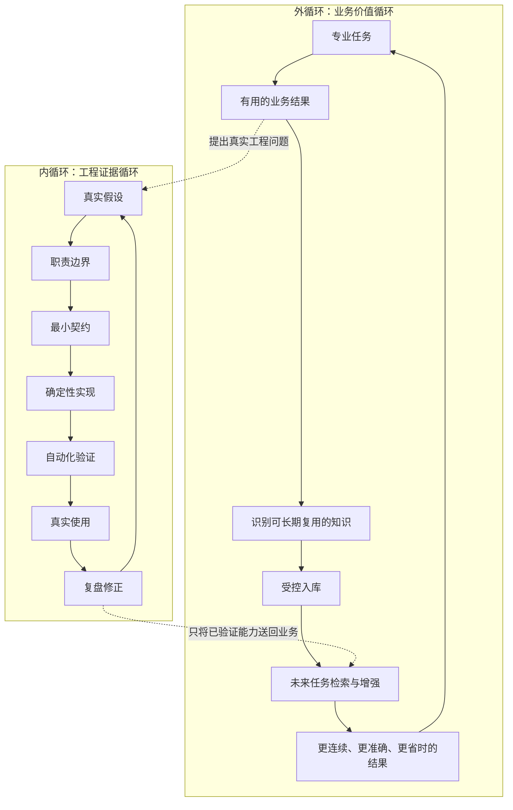
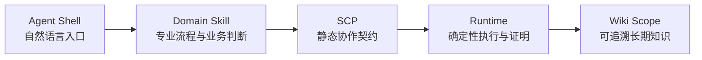
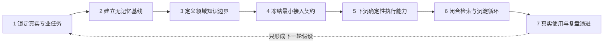

# 专业 Skill 双循环工程法

> 以专业任务产生价值，以受控知识形成复利，以工程证据驱动演进。

- 版本：V1.0
- 英文名：Professional Skill Dual-Loop Engineering
- 日期：2026-08-01
- 性质：设计与工程落地方法论
- 首个证据基线：`llm-wiki-runtime` V0.1、SCP v0.1 与 HR Domain 实验

## 1. 方法定位

### 1.1 这套方法解决什么问题

专业 Skill 双循环工程法用于指导个人开发者或小型团队构建可在真实业务中持续使用的企业 AI 能力。

它关注的不是“怎样做一个无所不能的 Agent”，而是以下问题：

1. 怎样把稳定的专业流程固化为可复用的 Skill。
2. 怎样让知识增强默认参与工作，又不破坏原业务流程。
3. 怎样把语义判断留给 Domain，把安全执行交给确定性 Runtime。
4. 怎样让长期知识有来源、可授权、可审计、可降级。
5. 怎样用真实任务和工程证据决定下一步，而不是由架构想象推动平台扩张。

### 1.2 适用对象

主要读者是：

- Skill 和 Agent 开发者。
- 企业 AI 架构设计者。
- 需要把专业流程接入长期知识能力的 Domain 维护者。
- 希望以单人或小团队方式交付企业 AI 应用的工程师。

### 1.3 不解决什么问题

本方法不等于：

- 一套通用 Agent 框架。
- 一个自动解决记忆、上下文和模型漂移问题的万能中间件。
- 任意第三方 Skill 都能无改造接入的行业标准。
- 必须使用 `llm-wiki-runtime` 的产品绑定方案。
- 一套要求最终用户理解 CLI、YAML、Scope 或 Profile 的使用流程。

`llm-wiki-runtime`、SCP 和 HR 是本方法的首个工程证据，不是方法的全部适用范围。

### 1.4 使用方式

面对一个新 Domain 时：

1. 先用第 5 章的七步工程循环判断当前处于哪一步。
2. 用第 6 章的接入决策画布决定是否应该继续。
3. 用第 9 章的证据等级约束能声称的结论。
4. 用第 10 章模板留下任务、契约、验收与复盘工件。

任何一道门没有通过，都应该回到问题所在的上一步，而不是继续增加协议、检索、图谱或平台能力。

## 2. 证据边界

### 2.1 三种证据状态

本文统一采用三种状态：

| 状态 | 含义 | 可以怎样表述 |
| --- | --- | --- |
| 已验证 | 已有自动化测试和真实任务共同支持 | “当前场景已经证明可以工作” |
| 部分验证 | 主链路成立，但某些语义、规模或边界尚未闭合 | “已经验证 A，B 仍需继续使用验证” |
| 明确暂缓 | 主动不进入当前版本，等待真实问题出现 | “当前不做，不把它伪装成已完成能力” |

### 2.2 当前已经证明什么

基于 HR 首个 Domain，当前已经证明：

> 一个现有专业 Skill 可以通过静态协作契约和 Domain Profile，接入一个通用、确定、可选的本地知识运行时；最终用户不需要理解底层 CLI、YAML 或目录结构。

具体包括：

- Domain Skill 可以保留业务语义主权。
- Runtime 可以提供安全读写、索引、来源、日志、锁、校验和幂等能力。
- 已初始化的 Wiki 可以被 Domain Skill 自动发现并用于任务前查询。
- 有长期价值的数据可以经预览和确认后受控入库。
- Runtime 不可用时，原 Domain Skill 仍可继续业务工作。
- 真实数据可以被投影为带证据的离线图谱，用于发现知识质量问题。

### 2.3 当前不能外推什么

以下结论尚未被 HR 实验证明：

- SCP 已经是行业通用协议。
- 任意第三方 Skill 都能直接兼容。
- 向量检索一定优于确定性 Context Pack。
- 跨 Domain 动态拉取、自动同步和写入已经成熟。
- HR Person Resolution、同名消歧和招聘生命周期已经完整建模。
- V0.2 memory、trace 和 eval 的假设已经成立。
- 本地 Runtime 已经适合直接演进为云端或企业服务平台。

## 3. 双循环总模型

### 3.1 总图



### 3.2 外循环：业务价值循环

外循环回答“为什么做，以及是否真的变得更好”。

完整路径是：

```text
专业任务
-> 产生业务结果
-> 识别其中可长期复用的知识
-> 经来源、授权和边界检查后受控入库
-> 在未来任务中检索
-> 形成更好的业务结果
```

外循环的判断标准不是“存了多少文件”，而是：

- 后续任务是否真正使用了历史知识。
- 使用后是否减少了重复输入和上下文丢失。
- 结果是否更连续、准确或高效。
- 新知识是否值得未来再次使用。

### 3.3 内循环：工程证据循环

内循环回答“能力是否可信，以及下一步应该改什么”。

完整路径是：

```text
真实假设
-> 定义职责边界
-> 冻结最小契约
-> 实现确定性能力
-> 自动化验证
-> 放入真实任务
-> 复盘并形成下一轮假设
```

内循环要求每个结论都能回到证据：

- 哪条自动化测试覆盖了它。
- 哪个真实任务使用了它。
- 哪种失败或评审意见迫使设计改变。
- 当前结论的适用边界在哪里。

### 3.4 两个循环的关系

外循环决定系统是否产生价值，内循环决定能力是否值得信任和继续演进。

两者的关系是：

- 内循环服务外循环。
- 没有业务收益时，不独立优化架构复杂度。
- 没有工程证据时，不把一次成功 Demo 升格为稳定能力。
- 真实使用提出下一轮问题，复盘只形成假设，不直接授权扩建平台。

## 4. 架构模型与六条原则

### 4.1 五个概念层



`llm-wiki-core` 是 Agent 侧的通用编排实现，负责 `init`、`ingest`、`query` 和 `maintain`。它消费 SCP 并调用 Runtime，但不拥有 Domain 语义，也不绕过 Runtime 直接写 Wiki。

| 概念层 | 负责 | 不负责 |
| --- | --- | --- |
| Agent Shell | 自然语言交互、Skill 发现和宿主工具能力 | 直接决定长期数据结构 |
| Domain Skill | 专业流程、业务语义、数据价值判断、内容生成和用户确认 | 文件锁、原子写和通用索引 |
| SCP | 静态声明 Domain、Profile、读写能力、信任与降级 | 保存用户机器上的启用状态 |
| Runtime | 配置解析、安全读写、索引、来源、锁、校验和、日志与结构化状态 | 理解候选人、课程、告警或新闻的业务语义 |
| Wiki Scope | 保存某个 Domain 的可追溯长期知识 | 自动判定什么是真实业务事实 |

### 4.2 原则一：以专业 Skill 为交付单元

企业 AI 的首要交付单元应该是可描述、可验证、可复用的专业流程，而不是从零搭建一个覆盖全部工作的通用 Agent。

一个合格的专业 Skill 至少能够说明：

- 谁使用它。
- 在什么触发条件下使用。
- 需要哪些输入。
- 产生什么业务结果。
- 哪些事情明确不负责。

知识增强只有在这个基线成立后才有意义。

### 4.3 原则二：分层负责，协议连接

每一层只承担自己能够稳定保证的职责，跨层协作使用显式契约。

分层不是为了增加文件数量，而是为了回答三个问题：

1. 谁拥有业务含义。
2. 谁保证执行结果。
3. 失败时谁负责降级。

如果一个行为无法明确归属，它就不应直接进入实现。

### 4.4 原则三：领域拥有语义，Runtime 拥有访问

核心边界是：

> Domain owns meaning, runtime owns access.

Domain Skill 决定：

- 什么是有价值的长期知识。
- 数据以哪些业务实体组织。
- 哪些字段和引用有业务含义。
- 什么时候查询、写入和要求用户确认。

Runtime 决定：

- 路径是否安全。
- 写入模式是否符合声明。
- 引用是否存在。
- Registry 和日志是否被原子更新。
- 重试是否会产生重复数据。

Runtime 不在缺少 Domain Mapping 时猜测业务结构。

### 4.5 原则四：不确定性上浮，确定性下沉

LLM 擅长理解模糊意图、判断语义和编排流程；程序擅长保证边界、状态和可重复结果。

因此：

| 放在 Skill 或 LLM | 下沉到 Runtime 或工具 |
| --- | --- |
| 意图识别 | 路径边界 |
| 业务材料判断 | 原子写与文件锁 |
| 是否值得长期复用 | Registry 与 checksum |
| 上下文如何参与回答 | JSON Contract 与 exit code |
| 预览和确认文案 | 幂等、日志和失败恢复 |

Prompt 可以提出要求，但不能替代硬保证。

### 4.6 原则五：契约声明能力，绑定决定启用

静态能力和动态状态必须分开。

```text
scp.yml
  声明 Skill 能做什么

runtime config + .llm-wiki.yml
  记录当前用户、机器和 Scope 是否启用

.llm-wiki/.meta/profile.yml
  保存当前 Scope 实际执行的 Profile 快照
```

因此：

- 初始化不能修改随 Skill 发布的 `scp.yml`。
- Storage Mode 不应由 Skill 写死，应由 Runtime Binding 或 Host Policy 决定。
- 显式 Local Scope 的发现优先于 Home Profile 的 decline 状态。
- 用户拒绝启用时要持久化拒绝，避免反复打扰。
- `missing`、`disabled`、`profile_mismatch`、`io_error` 和 `runtime_unavailable` 都必须有确定的消费行为。

### 4.7 原则六：长期知识必须通过四道门

只有同时满足以下条件的数据才进入长期知识库：

1. **可复用**：未来专业任务有明确使用场景。
2. **有来源**：能够回到文件、消息、系统记录或人工输入。
3. **获授权或确认**：特别是敏感数据，不能静默落库。
4. **归属明确**：由具体 Domain 拥有语义和维护责任。

以下内容默认不自动入库：

- 模型推测。
- 未经确认的判断。
- 临时讨论。
- 与未来任务无明确关系的完整对话。
- 无法说明来源和用途的中间内容。

## 5. 七步 Skill 工程循环

### 5.1 总览



### 5.2 第一步：锁定真实专业任务

**关键问题**

- 谁会在真实工作中反复使用它。
- 它解决哪个具体专业任务。
- 结果支持哪个实际行动。
- 什么不在本次范围内。

**必须工件**

- 一张任务卡。
- 至少一个真实输入样本。
- 明确的业务输出和非目标。

**通过门槛**

任务可以被演示和验收，不需要用“万能助手”解释其价值。

**停步信号**

- 只知道要做一个 Agent，不知道先解决哪个专业任务。
- 输出只是对话，没有后续使用者或业务动作。

### 5.3 第二步：建立无记忆业务基线

**关键问题**

没有 Wiki、长期记忆或增强上下文时，Skill 是否已经能完成核心工作。

**必须工件**

- 原始 Domain Skill。
- 输入输出示例。
- 失败和 fallback 行为。

**通过门槛**

Wiki 缺失、禁用或故障时，核心业务任务仍然可以完成。

**停步信号**

- 试图用记忆补偿尚未稳定的专业流程。
- 接入 Runtime 后，原 Skill 反而不能单独运行。

### 5.4 第三步：定义领域知识边界

**关键问题**

- 哪些事实会被未来任务复用。
- 以什么业务实体作为组织主线。
- 谁拥有这些数据的业务含义。
- 哪些内容明确不入库。

**必须工件**

- Domain Profile。
- 实体锚点和 ID 规则。
- 读写规则。
- 来源、隐私和信任规则。
- 入库四道门和排除项。

**通过门槛**

每类数据都有 owner、source、用途和隐私边界，临时推理被明确排除。

**停步信号**

- 目录结构由 Runtime 猜测。
- 以“以后也许有用”为理由保存全部内容。

### 5.5 第四步：冻结最小接入契约

**关键问题**

- Skill 声明哪些能力。
- Runtime 保证哪些行为。
- 不可用时如何回到原流程。

**必须工件**

- `scp.yml`。
- `llm-wiki-profile.yml`。
- 所需的 `ingest-mapping.yml`。
- Runtime CLI Contract。
- 状态与错误矩阵。

**通过门槛**

静态能力与动态状态分离，每种失败状态都有明确的 Skill 消费行为。

**停步信号**

- SCP 保存初始化结果或本机路径。
- 协议一次性声明大量尚未使用的未来能力。

### 5.6 第五步：下沉确定性执行能力

**关键问题**

哪些操作一旦出错会破坏数据、审计、权限或用户信任，必须由程序保证。

**必须工件**

- CLI 结构化 JSON 输出和 exit code。
- 路径变量和 Root Boundary 校验。
- Scope Lock、超时与崩溃恢复。
- 原子写、checksum、Registry 和 append-only 日志。
- 幂等和失败恢复策略。
- 自动化测试。

**通过门槛**

成功、重复执行、并发、崩溃和主要失败路径都有自动化验证。

**停步信号**

- 模型直接修改 Registry 或长期知识文件。
- “Prompt 已经要求不要覆盖”被当作硬保证。

### 5.7 第六步：闭合检索与沉淀循环

**关键问题**

如何让长期知识默认参与任务，同时不越权、不打扰、不污染知识库。

**标准流程**

```text
Resolve Runtime Binding
-> Query Before Work
-> Domain Work
-> 判断是否产生长期价值
-> Preview / Confirm
-> Ingest After Work
```

首次未启用时：

```text
先完成原业务工作
-> 发现可复用数据
-> 用业务语言询问一次是否启用
-> 自动初始化
-> 展示待入库内容
-> 用户确认后写入
```

**必须工件**

- Preflight、Query、Ingest 和 Fallback 共享合同。
- 面向用户的首次启用流程。
- Preview 和确认边界。
- 查询过滤和上下文消费规则。

**通过门槛**

- 只取当前任务相关的上下文。
- 拒绝或故障不阻塞原任务。
- 重试不产生重复记录。
- 未加载或未写入时不伪装成功。

**停步信号**

- 每次任务都重复询问是否启用。
- 用户必须手动运行 CLI 或编辑 YAML。
- supporting context 可以覆盖 primary Domain 事实。

### 5.8 第七步：真实使用，复盘演进

**关键问题**

- 下一次真实任务是否真的使用了历史知识。
- 使用后是否改善结果或降低重复劳动。
- 哪些问题在真实规模下才出现。
- 下一版本是否有足够证据启动。

**必须工件**

- 自动化测试报告。
- 至少一条跨任务的真实闭环记录。
- 工程复盘。
- 已验证、部分验证和暂缓清单。
- 下一轮假设，而不是未经验证的功能清单。

**通过门槛**

能够用证据说明：写入正确、后续取回、真实有用、失败可恢复。

**停步信号**

- 只有 Demo 截图，没有跨任务复用。
- 尚未观察到稳定问题，就开始建设 V0.2、复杂检索或平台控制面。

## 6. 新 Domain 接入决策画布

本画布不仅判断是否值得接入 Runtime，还必须判断真实调用主体属于 `Skill-only`、`Harness-only` 还是 `Skill+Harness`。存在独立 CLI、Scheduler、Service、Plan、Human Gate、Receipt 或恢复流程时，不能默认把 Harness 伪装成 Skill。完成本章盘点后，使用[Skill + Harness Runtime 0.3 评估与实施手册](../guides/skill-harness-llm-wiki-runtime-integration.zh.md)冻结 Principal 与 Mapping Owner。

### 6.1 接入前先填写

| 字段 | 要回答的问题 |
| --- | --- |
| Domain | 业务领域是什么 |
| 目标用户 | 谁会真实、反复使用 |
| 专业任务 | 本次只解决哪个可验收流程 |
| 业务结果 | 结果支持什么判断或行动 |
| 知识主权方 | 哪个 Domain Skill 定义语义 |
| 数据风险 | 是否包含隐私、外部来源、跨 Domain 或分享风险 |

### 6.2 阶段一：写接入代码之前

#### 门一：任务真实性

- [ ] 用户、触发、输入、输出、频率和风险都能写清。
- [ ] 已有或可以先实现一个独立工作的专业 Skill。
- [ ] 需求不是“以后可能有用的万能助手”。

#### 门二：无增强基线

- [ ] Wiki 不存在时，核心任务仍能完成。
- [ ] fallback 行为已经写入 Skill 合同。
- [ ] 记忆不是用来掩盖未稳定的专业流程。

#### 门三：知识主权

- [ ] 每类长期数据都有 Domain Owner。
- [ ] 已定义实体、ID、来源、用途和隐私。
- [ ] 已列出明确不入库的内容。
- [ ] 数据必须通过可复用、来源、授权和归属四道门。

#### 门四：最小契约

- [ ] SCP 只声明静态能力。
- [ ] Profile 声明 Domain 的存储合同。
- [ ] Mapping 由 Domain 拥有。
- [ ] Runtime Binding 管理 Storage Mode 和启用状态。
- [ ] missing、disabled、mismatch、I/O error 和 runtime unavailable 都有消费行为。

### 6.3 外部来源附加检查

如果 Domain 摄入网页、新闻、附件或其他半可信内容：

- [ ] SCP 显式声明信任策略。
- [ ] supporting context 使用 data-only 隔离。
- [ ] 保留来源和信任标记。
- [ ] 外部内容中的指令不能覆盖 primary Domain 事实和宿主指令。
- [ ] 跨 Domain 在 V0.1 只进行受声明的查询引用，不自动跨域写入。

### 6.4 阶段二：准备真实使用之前

#### 门五：确定性执行

- [ ] 所有长期写入都通过 Runtime。
- [ ] CLI 返回结构化 JSON 和稳定 exit code。
- [ ] 路径、锁、原子写、Registry、checksum、日志和幂等均有测试。
- [ ] 崩溃、并发和重试不会破坏已成功数据。

#### 门六：用户无感增强

- [ ] 用户只需使用业务语言。
- [ ] 首次启用只需一次明确确认。
- [ ] 用户拒绝会被持久化，不会跨目录反复打扰。
- [ ] 已启用时自动 Query。
- [ ] 入库前有 Preview 和必要确认。
- [ ] 增强失败不阻塞原 Domain Skill。

#### 门七：工程证据

- [ ] 有合同测试、端到端测试、幂等和失败路径测试。
- [ ] 有跨任务的真实使用记录。
- [ ] 能说明上下文是否被实际使用。
- [ ] 有复盘文档区分已验证、部分验证和暂缓。
- [ ] 只有真实问题稳定出现后才启动下一版本。

### 6.5 一个 Domain 的最小接入包

至少包括：

1. 可独立工作的 Domain Skill。
2. 每个业务子 Skill 的 `scp.yml`。
3. Domain 拥有的 `llm-wiki-profile.yml`。
4. 按 Source 类型提供的 Mapping。
5. Runtime 与 Skill 合同测试。
6. 至少一条真实任务的闭环验收记录。

图谱、向量检索、跨 Domain 动态拉取和平台控制面不属于最小接入包。

## 7. HR 首个 Domain 的证据映射

### 7.1 七步映射

| 工程步骤 | HR 实践证据 | 状态 | 当前边界 |
| --- | --- | --- | --- |
| 1. 真实专业任务 | 使用现有 Resume Screening、Candidate Detail Report 和 Interview Question Generator；以真实简历筛选和历史 JD 导入为任务 | 已验证 | 不代表全部 HR 工作已建模 |
| 2. 无记忆基线 | 三个 HR Skill 保留原流程；SCP 为 `required=false`；Runtime 不可用时继续业务；Preparation Gate 修正了真实触发失败 | 已验证 | Wiki 是增强后端，不是单点依赖 |
| 3. 知识边界 | 统一 HR Profile；区分 Candidate、Resume Source、Job、JD Version 与日志；首次只导入 JD 以缩小隐私面 | 部分验证 | Person Resolution、同名消歧和完整 Case Timeline 未完成 |
| 4. 最小契约 | 父 Skill 只路由，三个子 Skill 各自拥有 SCP；Profile、Mapping 和 CLI 分工明确；Storage Mode 移出 SCP | 已验证 | 仅验证 first-party HR，未验证任意第三方兼容 |
| 5. 确定性执行 | 路径、锁、死亡 PID 回收、原子写、checksum、Registry、日志、Context Pack 和幂等返回均进入 Runtime | 已验证 | 硬保证只覆盖 Runtime 管理的写入 |
| 6. 增强闭环 | 完成自然语言 Init；从旧任务选择 4 个 JD 片段，经确认写入同一岗位；新任务可查询；重试返回 `already_exists` | 部分验证 | 完整招聘生命周期的自动追加仍需继续使用验证 |
| 7. 真实复盘 | 自动化测试、真实 HR Scope、图谱导出和 Diagnostic 共同暴露数据质量问题 | 已验证 | 图谱是诊断投影，不是新的事实来源 |

### 7.2 第一次受控闭环

第一次实验没有直接迁移全部简历和候选人隐私数据，而是选择历史 JD：

```text
旧任务：筛选技术支持外包简历
确认片段：4 个 JD 原文片段
job_id：delivery-technical-support-outsourcing
```

闭环包括：

1. 从旧任务中定位来源片段。
2. 展示选择范围和目标岗位。
3. 用户确认。
4. 保存 JD-only Evidence Snapshot。
5. 写入长期 Job Profile 和不可变 JD Version。
6. 在新查询中返回 Profile、Version、Source 和 Context References。
7. 重复执行返回 `already_exists`，不产生重复 Source、Version 或事件。

这次实验同时验证了来源、授权、隐私范围、查询和幂等。

### 7.3 真实使用规模

截至 2026-07-25，HR Scope 的非敏感数量统计包括：

| 类型 | 数量 |
| --- | ---: |
| Candidate Profile | 72 |
| Resume Source | 72 |
| Job Profile | 2 |
| JD Version | 2 |
| HR JD Import Event | 2 |

这些数据证明 HR Wiki 已越过一次性 JD Demo，进入实际使用阶段。

### 7.4 工程验证

V0.1 基线：

- Runtime 自动化测试：107 passed。
- HR Skill Contract：12 tests passed。
- 独立 HR JD 端到端：1 passed。

同步图谱、HR 展示和通用 Record Lookup 后的最新主线：

- Python：325 passed。
- Node：18 passed。
- Playwright Browser Smoke：passed。

### 7.5 为什么图谱属于第七步

当 Scope 中已有 72 个 Candidate Profile、72 个 Resume Source 和多个岗位版本后，仅查看目录和 Markdown 已无法快速检查关系质量。

因此图谱是在主闭环之后，根据真实规模问题增加的确定性观察工具。2026-07-22 的实际导出结果为：

```text
nodes: 156
edges: 155
```

图谱暴露了：

- `ambiguous_structured_reference`
- `self_structured_reference`
- `unresolved_structured_reference`

它的价值是把下一轮数据治理问题变得可见。它不调用 LLM 猜测人物关系，也不成为新的业务事实来源。

## 8. 反模式与五条底线

### 8.1 常见反模式

#### 反模式一：先做万能 Agent，再找业务任务

结果通常是意图、记忆、缓存、上下文和工具都很复杂，但无法说明哪项专业工作真正改善。

#### 反模式二：用记忆补偿不成熟的 Skill

如果原业务流程不稳定，记忆只会让错误和模糊判断持续存在。

#### 反模式三：让 Runtime 理解所有 Domain

当 Runtime 直接生成 HR、Learning 或 DevOps 业务结构时，它会迅速变成难以维护的业务框架。

#### 反模式四：把动态状态写进静态契约

初始化后修改 SCP 会导致升级、重装、多机器和多 Scope 状态失真。

#### 反模式五：把 Prompt 当作硬保证

“不要覆盖”“不要越界”“不要重复写入”必须由路径校验、写入模式、锁和幂等实现保证。

#### 反模式六：静默保存敏感数据

自动增强不等于自动越权。首次启用和敏感数据入库需要明确、低负担的用户确认。

#### 反模式七：让增强失败阻断业务

可选知识后端不应成为原 Domain Skill 的新单点故障。

#### 反模式八：用架构图推动下一版本

没有稳定出现的真实问题时，memory、trace、eval、向量检索和跨 Domain 平台都只是未验证假设。

#### 反模式九：把可视化当作事实来源

图谱和报表只能投影已有确定性记录和显式证据，不能产生“看起来合理”的新关系。

### 8.2 五条不可破坏的底线

1. 不绕过 Runtime 直接写长期知识。
2. 不静默摄入敏感或未经确认的数据。
3. 不让初始化修改静态 SCP 契约。
4. 不让增强失败阻断原业务 Skill。
5. 不在真实证据出现前扩建下一版本。

## 9. 证据成熟度与演进规则

### 9.1 每项能力都写成四元组

评审一项能力时，必须同时记录：

```text
能力：它能做什么
证据：哪些测试和真实任务支持
边界：当前不能保证什么
下一假设：需要什么新证据才继续
```

仅描述“能力”而不描述其他三项，不能进入稳定结论。

### 9.2 成熟度判断

| 阶段 | 证据 | 允许动作 |
| --- | --- | --- |
| 假设 | 只有需求或设计推断 | 设计最小实验，不扩建平台 |
| 工程可行 | 自动化测试通过 | 进入受控真实任务 |
| 业务可用 | 至少一次真实闭环 | 继续使用并观察重复问题 |
| 可重复 | 多次任务稳定复用，失败可恢复 | 固化合同和接入模板 |
| 可扩展候选 | 第二个 Domain 或第三方接入出现相同需求 | 评估通用抽象或协议升级 |

HR 当前证明 first-party 模式已经进入“可重复”候选区间，但尚未证明任意 Domain 或第三方兼容，因此不能直接跳到行业通用标准。

### 9.3 启动下一版本的条件

下一版本不是由日历或架构完整度触发，而由稳定问题触发。

至少应回答：

- 同一问题是否在多个真实任务中重复出现。
- 它是否无法通过 Domain 内部调整解决。
- 它是否需要修改共享契约或 Runtime。
- 新能力是否有最小可验证闭环。
- 失败和降级是否仍然清楚。

## 10. 可复制模板

### 10.1 专业任务卡

```markdown
# 专业任务卡

- Domain：
- 目标用户：
- 使用场景：
- 触发语句或事件：
- 必要输入：
- 业务输出：
- 输出支持的行动：
- 使用频率：
- 主要风险：
- 明确非目标：
- 无 Wiki 时的基线行为：
```

### 10.2 知识边界表

```markdown
# Domain 知识边界

| 数据类型 | Domain Owner | 实体与 ID | 来源 | 未来用途 | 隐私 | 写入模式 | 明确排除 |
| --- | --- | --- | --- | --- | --- | --- | --- |
| | | | | | | | |

入库四道门：
- [ ] 可复用
- [ ] 有来源
- [ ] 获授权或确认
- [ ] Domain 归属明确
```

### 10.3 接入合同清单

```markdown
# Domain 接入合同

- [ ] Domain Skill 无 Wiki 时仍可工作
- [ ] 父路由与业务子 Skill 的职责清楚
- [ ] 每个需要增强的子 Skill 有 SCP
- [ ] SCP 不包含动态启用状态和 Storage Mode
- [ ] Profile 定义目录、读写规则和隐私默认值
- [ ] Mapping 由 Domain 拥有
- [ ] Query / Ingest / Fallback 行为明确
- [ ] 外部内容声明 Trust 和 data-only 隔离
- [ ] 所有长期写入通过 Runtime
- [ ] missing / disabled / mismatch / io_error / unavailable 均有行为
```

### 10.4 真实闭环验收记录

```markdown
# 真实闭环验收

- Domain：
- 任务：
- 日期：
- 原业务是否完成：
- Runtime Binding 状态：
- Query 返回了什么：
- 哪些上下文被实际使用：
- 本轮产生了什么长期数据：
- 来源：
- 用户确认：
- Ingest 结果：
- 重试结果：
- Runtime 故障时的 fallback：
- 隐私人工检查：
- 已验证结论：
- 部分验证结论：
- 暂缓内容：
```

### 10.5 工程复盘模板

```markdown
# Domain Skill 增强工程复盘

## 目标与范围

## 原业务基线

## 知识边界

## 契约与职责

## 确定性实现

## 自动化验证

## 真实使用证据

## 评审和失败中修正的问题

## 已验证 / 部分验证 / 暂缓

## 下一轮真实假设
```

## 11. 术语与参考资料

### 11.1 术语

| 术语 | 含义 |
| --- | --- |
| Agent Shell | 提供自然语言交互、Skill 路由和宿主工具能力的外壳，如 Codex 或 Claude Code |
| Domain Skill | 拥有某个专业领域流程和业务语义的 Skill |
| SCP | Skill Context Protocol，Domain Skill 与知识增强层之间的静态协作契约 |
| `llm-wiki-core` | Agent 侧通用编排 Skill，提供 init、ingest、query、maintain |
| Runtime | 提供确定性配置、安全读写、索引、来源、日志和状态返回的执行层 |
| Profile | Domain 与 Runtime 之间的存储合同 |
| Mapping | 将某类 Source 映射为 Domain 产物的语义适配规则，由 Domain 拥有 |
| Runtime Binding | 当前用户、机器和 Scope 上的动态启用与存储绑定 |
| Context Pack | Runtime 按确定性规则返回的受控上下文集合 |
| supporting context | 供当前 Domain 参考但不能覆盖 primary Domain 事实的其他来源上下文 |

### 11.2 参考资料

- [llm-wiki-runtime V0.1 工程复盘](../retrospectives/llm-wiki-runtime-v0.1-engineering-retrospective.zh.md)
- [Skill + Harness Runtime 0.3 评估与实施手册](../guides/skill-harness-llm-wiki-runtime-integration.zh.md)
- [Domain Skill 通用接入手册](../guides/domain-skill-integration-quickstart.zh.md)
- [HR 接入指南](../guides/hr-llm-wiki-integration.zh.md)
- [HR Skill 实施指南](../guides/hr-skill-llm-wiki-runtime-implementation.zh.md)
- [SCP v0.1 设计](../superpowers/specs/2026-07-07-skill-context-protocol-v0-1-design.zh.md)
- [Runtime V0.1 边界与加固设计](../superpowers/specs/2026-07-07-llm-wiki-runtime-v0-1-boundary-and-v0-1-1-hardening.zh.md)
- [离线图谱导出指南](../guides/graph-export.zh.md)

## 12. 一句话总结

专业 Skill 双循环工程法不追求一次设计出完整平台。它先用专业任务证明价值，再让可追溯知识形成复利，同时用确定性工具、真实使用和工程复盘限制每一步演进。
