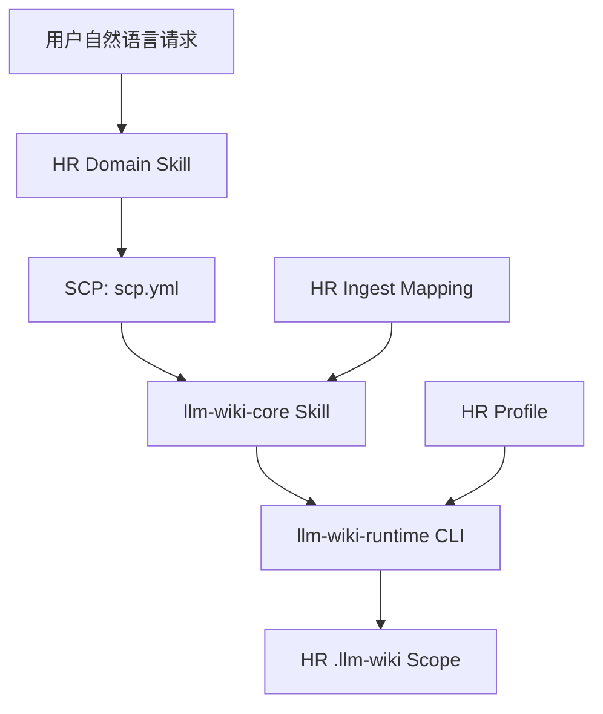

# llm-wiki-runtime V0.1 工程复盘：从运行时设计到 HR 首个 Domain 验证

日期：2026-07-25

性质：内部技术复盘

状态：HR 首个 Domain 已完成真实使用验证

## 1. 复盘范围

本文复盘的是 `llm-wiki-runtime` V0.1 从需求讨论、架构设计、协议设计、工程实现，到 HR 第一个 Domain Skill 接入和真实测试的完整过程。

本文重点回答：

1. 最初要解决的具体问题是什么。
2. 为什么最终形成 `Domain Skill + SCP + llm-wiki-core + Runtime CLI`。
3. `llm-wiki-runtime` V0.1 实际实现了哪些确定性能力。
4. SCP v0.1 如何约束 Skill 与 Runtime 的协作。
5. HR 是怎样完成第一个标准化接入和真实验证的。
6. HR 数据进入实际使用后，如何被确定性导出为离线知识图谱。
7. 过程中暴露了哪些设计和工程问题，最后如何修正。
8. 当前哪些能力已经完成，哪些仍然只是后续设计。

本文不讨论：

- DevOps、Learning、AI Radar 等其他 Domain 的工程接入。
- V0.2 的 memory、trace、eval 和动态模型拉取。
- 从本次实践进一步抽象出的企业 AI 方法论。

其他 Domain 只在 SCP 通用性设计的背景中出现，不代表已经完成接入。

## 2. 起点：需要的不是另一个通用 Agent

最初讨论从企业 AI 应用开发的优先级开始：

1. 用 Skills 固化专业流程。
2. 用工具链保证执行。
3. 用上下文治理保证可控。
4. 用 Java 企业能力承接真实业务系统。
5. 用轻量桌面或 Web 入口降低使用门槛。

当时已经存在 Project Skill 自带的 `llm-wiki` 思想，但 HR 等其他 Copilot 没有稳定的跨会话知识能力。最早的直觉是把 Project 里的能力“通用化”，让任何 Skill 都能安装后自动接入。

讨论很快暴露出一个边界问题：

```text
如果所有能力都塞进一个通用 Agent，
就必须同时处理记忆、上下文、缓存、路由、存储和业务语义。
```

这会重新走回“从零构建完整 Agent”的高成本路径。最终目标被收敛为：

> 建立一个横向的本地知识运行时，让专业 Domain Skill 保持业务主权，同时获得可靠、可选、可降级的知识读取和写入能力。

这一收敛决定了后面的全部设计。

## 3. 方案演进与关键取舍

### 3.1 从“通用 Skill”到“Skill + CLI”

只做一个 `llm-wiki-core` Skill 的优点是可以直接借用 Codex、Claude Code 等 Agent Shell 的自然语言理解、Skill 路由和宿主工具。

但纯 Skill 方案无法对以下行为提供足够确定的保证：

- 路径是否越界。
- `create_only` 是否真的不可覆盖。
- Registry 是否被原子更新。
- 并发写入是否会破坏 JSON 或 JSONL。
- 引用的 `source_id` 是否真实存在。
- 重试是否会重复写入。

因此最终选择双层结构：

```text
llm-wiki-core Skill
  负责自然语言、意图判断、预览、确认和流程编排

llm-wiki-runtime CLI
  负责确定性配置、校验、读写、锁、索引和状态返回
```

用户仍然通过自然语言使用 Skill；CLI 是 Skill 的执行契约，不是要求 HR 用户学习的终端界面。

### 3.2 没有把 Runtime 做成业务框架

Runtime 不理解“候选人”“岗位”“简历”“面试”这些语义，也不替 HR 判断哪些数据值得保存。

最终边界被固定为：

> Domain owns meaning, runtime owns access.

具体含义是：

- Domain Skill 决定什么是有价值的知识。
- Domain Skill 生成业务 ID、业务内容和用户确认文案。
- Runtime 校验写入是否符合声明、引用是否存在、路径是否安全。
- Runtime 不生成 HR 字段，不决定两个岗位是否属于同一个岗位。
- Runtime 不在没有 Domain Mapping 时猜测业务结构。

### 3.3 没有把初始化状态写回 SCP

早期曾考虑：HR 初始化完成后，修改 `scp.yml`，通过协议文件告诉 Skill “Wiki 已经启用”。

该方案最终被否决，因为 `scp.yml` 是随 Skill 发布的静态能力声明，而初始化属于用户、机器和 Scope 的动态状态。修改 SCP 会把发布契约和运行状态混在一起，并导致 Skill 升级、重新安装和多机器使用时状态失真。

最终采用：

```text
scp.yml
  静态声明 Skill 能做什么

runtime config + .llm-wiki.yml
  动态记录当前机器和 Scope 是否启用

.llm-wiki/.meta/profile.yml
  保存当前 Scope 实际执行的 Profile 快照
```

Domain Skill 每次运行都通过 `resolve-config` 获取动态 Binding。

### 3.4 没有要求一线用户理解配置文件

第一版设计逐渐出现了 domain、profile、scope、init、ingest、query 等概念。对开发者是清楚的，但如果要求 HR 用户显式选择和执行这些步骤，系统会失去使用价值。

最终用户体验被改为：

```text
第一次业务任务
  -> 先完成原业务工作
  -> 产生可复用数据后再询问是否启用 Wiki
  -> 用户只回答一次确认
  -> Skill 自动安装/初始化
  -> 展示本次待入库内容
  -> 用户确认后入库

后续业务任务
  -> Skill 自动 resolve
  -> 已启用则自动 query
  -> 执行业务工作
  -> 有长期价值的数据自动进入 ingest 流程
```

用户拒绝启用时，Runtime 持久化 `disabled` 状态，避免在不同目录反复打扰。

### 3.5 V0.1 主动冻结复杂能力

评审过程中曾提出 memory、trace、eval、跨 Domain 动态拉取和向量搜索等能力。

最终决定先证明最小闭环：

```text
初始化成功
-> 有来源的数据安全入库
-> 新任务能够取回
-> 重试不重复
-> Runtime 不可用时原 Skill 仍可执行
```

因此 V0.1 明确不实现：

- 向量数据库和语义搜索。
- 跨 Domain 写入和自动同步。
- 模型在推理中途动态请求任意 Domain。
- 人物自动消歧和完整招聘生命周期状态机。
- 云端共享、服务端控制面和后台监听。

## 4. 最终总体架构



### 4.1 四层职责

| 层 | 职责 | 不负责 |
| --- | --- | --- |
| HR Domain Skill | 招聘业务语义、Skill 路由、材料判断、内容生成、用户确认 | 文件锁、原子写、通用索引 |
| SCP | 声明 Skill 的 Domain、Profile、查询关系、允许产物、信任和降级 | 保存启用状态、直接写数据 |
| `llm-wiki-core` | `init/ingest/query/maintain` 的 Agent 侧编排 | 绕过 Runtime 直接写 Wiki |
| `llm-wiki-runtime` | 配置解析、安全读写、锁、Registry、日志、Context Pack | HR 字段提取和招聘判断 |

### 4.2 四份接入材料

工程落地中最终形成四份互补材料：

| 文件或契约 | 回答的问题 |
| --- | --- |
| `scp.yml` | 这个 Skill 允许读取和生产什么 |
| `llm-wiki-profile.yml` | 这些数据写到哪里、采用什么写入模式 |
| `ingest-mapping.yml` | 某类 Source 如何映射为 Domain 产物 |
| Runtime CLI Contract | Core 如何确定性执行读写并获得结构化状态 |

其中三个正式边界是：

```text
SCP
  Skill 与 llm-wiki-core 的协作合同

Profile
  Domain 与 Runtime 的存储合同

CLI
  llm-wiki-core 与 Runtime 的执行合同
```

Mapping 是 Source 到 Domain 产物的语义适配层，由 Domain 拥有。

## 5. llm-wiki-runtime V0.1 设计与实现

### 5.1 Runtime Home、Scope 和 Profile

V0.1 区分：

```text
LLM Wiki Home
  当前用户的本地知识根目录

Domain Wiki Scope
  一个具体 Domain 的知识工作区

Profile
  该 Domain 在 Scope 中的目录和读写规则
```

Windows 默认 Home：

```text
C:\Users\<user>\Documents\LLM Wiki
```

HR 默认使用 Home Scope：

```text
<LLM_WIKI_HOME>\scopes\hr-default\
  .llm-wiki.yml
  .llm-wiki\
```

初始化前，`resolve-config --profile hr` 返回 `missing_config`，不能静默创建 Scope。用户确认后，`init-home` 和 `init-profile` 创建配置、目录和 Profile 快照。

### 5.2 CLI 能力面

V0.1 基线提供 12 个命令：

```text
version
resolve-config
init-home
init-profile
copy-source
register-artifact
append-log
write-record
load-context-pack
prepare-excerpt
validate-mapping
scan-scp
```

HR 实际使用后的本地图谱扩展又增加了：

```text
graph-export
```

它不改变上述读写合同，只读取已经落库的数据并把显式关系导出为离线产物，详见第 10.7 节。

命令按职责分为：

| 范围 | 命令 |
| --- | --- |
| Runtime 与配置 | `version`、`resolve-config`、`init-home`、`init-profile` |
| 数据写入 | `copy-source`、`write-record`、`register-artifact`、`append-log` |
| 上下文读取 | `load-context-pack` |
| Ingest 准备 | `prepare-excerpt` |
| 契约发现与校验 | `validate-mapping`、`scan-scp` |
| HR 实测后的离线可观察性扩展 | `graph-export` |

所有公开命令返回 JSON，而不是依赖不可解析的终端文本。状态包含：

```text
ok
enabled
missing_config
disabled
profile_mismatch
domain_mapping_required
already_exists
validation_error
read_denied
runtime_unavailable
io_error
unexpected_error
```

`already_exists` 是成功的幂等重试，不是写入失败。

### 5.3 路径与写入边界

路径模板中的 `{candidate_id}`、`{job_id}`、`{jd_version_id}` 等变量一律视为不可信数据。

Runtime 在渲染前校验：

- 非空。
- 不是 `.` 或 `..`。
- 不包含路径分隔符、盘符、冒号或控制字符。
- 符合保守 slug 规则。
- 渲染和标准化后仍位于 `wiki_root` 内。

Profile 支持三种写入模式：

| 模式 | 行为 |
| --- | --- |
| `create_only` | 已存在时拒绝不同内容覆盖 |
| `update_allowed` | 允许替换，但记录旧、新 checksum 和修订日志 |
| `append_only` | 只允许追加，用于业务事件日志 |

### 5.4 锁、原子写与崩溃恢复

所有 Scope 写操作共享独占锁：

```text
.llm-wiki/.meta/lock.json
```

最终补齐的规则包括：

- 初始化前允许先创建 `.meta/`。
- 通过等价于 `O_CREAT | O_EXCL` 的原子文件创建抢锁。
- 默认等待 30 秒。
- 锁记录 PID、Host、命令和时间。
- 同机 PID 已死亡时可立即回收。
- 跨 Host 超过阈值时先归档旧锁，再尝试获取新锁。
- Registry 和可替换文件使用同目录临时文件加原子 rename/replace。

这部分修复了早期设计中“初始化需要锁，但锁目录又依赖初始化”的循环问题。

### 5.5 来源、Registry 和可追溯性

`copy-source` 不只是复制文件，还负责：

- 计算 checksum。
- 登记 `source_id`。
- 保存受控 provenance。
- 防止同一路径被不同内容覆盖。
- 对相同 checksum 和 logical path 返回 `already_exists`。
- 目标已存在但 Registry 缺项时恢复登记。

`required_refs` 不只检查字段是否存在。Runtime 会确认：

- `source_id` 存在于 `sources/registry.json`。
- `artifact_id` 存在于 Artifact Index。
- Domain 自有引用至少满足非空和类型要求。

### 5.6 确定性 Context Pack

V0.1 没有采用向量检索。`load-context-pack` 使用确定性规则：

1. 先应用调用方给出的 path、glob、record type 或 ref 过滤。
2. 再应用 Profile 的 include/exclude。
3. 默认按路径排序。
4. 最后应用文件数量和字符上限。

调用方过滤只能缩小权限范围，不能扩大 Profile 允许读取的范围。

以下内容默认排除：

```text
sources/originals/**
.meta/**
```

Context Pack 返回路径、受控内容片段、checksum 和 `context_refs`，让最终回答能够说明本次用了哪些知识。

### 5.7 隐私和降级

`privacy_default: sensitive_local` 是提示和默认本地策略，不是加密或权限控制系统。

V0.1 的隐私边界主要依靠：

- 原始来源默认不进入 Context Pack。
- 敏感导入先预览、后确认。
- JD 历史导入只保留确认后的 JD 原文范围。
- Runtime 不允许降级流程绕过 CLI 直接写 `.llm-wiki`。

Runtime 是可选后端。以下状态都不能阻断 HR 原业务：

```text
missing_config
disabled
profile_mismatch
invalid_config
runtime_unavailable
io_error
```

降级时继续原 HR Skill，只能说明本轮未使用或未写入 Wiki，不能假装已经加载上下文或完成入库。

## 6. llm-wiki-core：主动 Skill 层

仓库对外提供一个可安装父 Skill：

```text
llm-wiki-core
```

内部包含四个主动子 Skill：

| 子 Skill | 职责 |
| --- | --- |
| `llm-wiki-init` | 检查 Runtime、发现 Domain、首次确认、初始化 Scope |
| `llm-wiki-ingest` | 识别 Source、加载 Mapping、预览、确认和写入 |
| `llm-wiki-query` | 确定 Domain、加载受控 Context Pack |
| `llm-wiki-maintain` | 扫描 SCP，检查 Profile、Mapping、配置和 Registry |

父 Skill 只路由一个子 Skill，不直接执行读写。

安装方式经过实际验证：

```bash
npx skills add huajiexiewenfeng/llm-wiki-runtime --skill llm-wiki-core --global
```

安装 Skill 不静默安装 Python Runtime。首次启用时由 `llm-wiki-init` 检查：

```text
llm-wiki version
```

Runtime 不存在时，必须先取得用户确认，再安装 Python 包。

## 7. SCP v0.1 协议设计

### 7.1 SCP 的定位

SCP 全称 Skill Context Protocol。

它不是：

- 存储格式。
- 网络传输协议。
- Runtime 配置。
- 业务数据 Schema。

它是 Skill 与 `llm-wiki-core` 之间的静态上下文协作声明。

### 7.2 最小声明

HR Resume Screening 的 SCP 核心结构是：

```yaml
scp_version: v0.1

skill:
  id: hr-resume-screening-copilot
  domain: hr

llm_wiki:
  profile: hr
  required: false
  fallback_mode: markdown

trust:
  level: internal_sensitive
  source_type: user_local_data
  instruction_policy: trusted_content

query:
  primary_domain: hr

ingest:
  produces:
    - domain: hr
      record_type: candidate_profile
    - domain: hr
      record_type: job_profile
    - domain: hr
      record_type: jd_version
    - domain: hr
      artifact_type: screening_report
    - domain: hr
      log_type: screening_run
    - domain: hr
      log_type: hr_jd_import
```

### 7.3 为什么 SCP 不声明 Storage Mode

早期 SCP 示例曾让 Skill 声明 `home` 或 `local`。评审指出这是部署抽象泄漏：Skill 只应表达自己需要哪个 Profile，实际落在 Home、Local 或未来 Server，应由宿主和 Runtime Policy 决定。

最终规则：

```text
SCP 声明 profile。
Runtime Binding 决定 storage_mode、scope_id 和 wiki_root。
```

### 7.4 Domain 路由顺序

Core 选择 Domain 的顺序是：

1. 用户显式指定。
2. 当前调用 Skill 的 SCP。
3. 当前 Scope 的 `primary_profile`。
4. Registry 和有限关键词辅助。
5. 仍不确定时询问用户。

意图识别只是兜底，不能覆盖用户显式指定，也不能成为所有 Skills 竞争同一自然语言入口的理由。

### 7.5 V0.1 的跨 Domain 边界

协议层预留了 `primary_domain + supporting_domains`，但 V0.1 的硬边界是：

```text
只允许在 query 阶段读取 supporting domain。
只允许写 primary domain。
```

本次 HR 工程验收没有把其他 Domain 接入作为完成条件，也没有验证跨 Domain 业务效果。

## 8. HR 第一个 Domain 的接入设计

### 8.1 为什么选择 HR

HR 同时具备：

- 明确的专业 Skill 流程。
- 跨会话复用价值。
- JD、简历、候选人档案等不同生命周期的数据。
- 明显的隐私和来源要求。
- 非技术用户体验要求。

因此 HR 能同时验证 Runtime 的可用性、安全边界和接入复杂度。

### 8.2 HR Skill 结构

HR 包包含一个父路由和三个业务子 Skill：

```text
hr-agent-copilot
  -> hr-resume-screening-copilot
  -> hr-candidate-detail-report-copilot
  -> hr-interview-question-generator-copilot
```

父 Skill：

- 只根据招聘阶段选择一个子 Skill。
- 不执行 `resolve-config`。
- 不加载 Context。
- 不拥有 `scp.yml`。
- 不直接执行招聘分析。

每个子 Skill 自己拥有 SCP，并负责自己的：

```text
preflight
-> query
-> 原业务流程
-> ingest
-> fallback
```

### 8.3 解决 Skill 触发失败

真实测试中出现了一个直接影响使用的问题：

```text
用户：我想做一次简历筛选，请先告诉我需要提供哪些材料，不要开始筛选。
```

旧 Skill 没有被触发，因为描述只覆盖“执行筛选”，没有覆盖“准备筛选”。这说明 Wiki 接入正确并不等于业务 Skill 一定会被 Agent Shell 路由。

修正包括：

- Skill description 增加“准备筛选”和“询问所需材料”意图。
- 增加 Preparation Gate。
- “不要开始筛选”被解释为业务阶段门，而不是绕过 Skill。
- 准备阶段只询问 JD、简历路径和输出偏好。
- 在用户真正开始筛选前，不读取简历、不评分、不写入 Wiki。

这个修正让 HR Skill 在真实自然语言下可以稳定进入正确入口。

### 8.4 HR Profile

HR Domain 提供统一 `llm-wiki-profile.yml`。

主要记录：

| Record | 路径 | 模式 |
| --- | --- | --- |
| `candidate_profile` | `domains/hr/candidates/{candidate_id}/profile.md` | `update_allowed` |
| `job_profile` | `domains/hr/jobs/{job_id}/profile.md` | `update_allowed` |
| `jd_version` | `domains/hr/jobs/{job_id}/versions/{jd_version_id}.md` | `create_only` |

主要日志：

| Log | 路径 | 模式 |
| --- | --- | --- |
| `screening_run` | `logs/hr-screening-run.jsonl` | `append_only` |
| `hr_jd_import` | `logs/hr-jd-import.jsonl` | `append_only` |

允许的 Artifact：

```text
screening_report
candidate_detail_report
interview_plan
```

Context Pack 只读取：

```text
domains/hr/**
```

并排除：

```text
sources/originals/**
.meta/**
```

### 8.5 三个 HR Skill 获得的 Wiki 行为

三个 Skill 都接入同一个 HR Scope，但拥有不同产物：

| Skill | 执行前 | 执行后 |
| --- | --- | --- |
| Resume Screening | 按候选人、岗位或筛选批次查询 | 候选人档案、筛选报告、筛选日志 |
| Candidate Detail Report | 查询候选人与当前招聘上下文 | Candidate Detail Report Artifact |
| Interview Question Generator | 查询候选人、JD 和已有证据 | Interview Plan Artifact |

当前实现已经具备“已初始化时自动查询、任务完成后按声明写入、失败时不阻塞业务”的接入骨架。

完整的自动 Person Resolution、同名消歧、Case Timeline、面试反馈、Offer、淘汰和入职状态仍不属于 V0.1 已完成能力。

## 9. 第一次受控实验：历史 JD 导入

### 9.1 为什么先选择 JD

直接迁移完整招聘会话会混入：

- 简历正文。
- 候选人姓名和联系方式。
- 模型评分和淘汰判断。
- 面试反馈。

为了验证链路而不扩大隐私面，Phase 1 只导入 JD。

目标闭环：

```text
llm-wiki-init
-> llm-wiki-ingest
-> llm-wiki-query
```

### 9.2 HR JD Mapping

HR 包增加：

```text
ingest-mapping.yml
references/llm-wiki-ingest.md
```

Mapping 声明：

```yaml
mapping:
  id: hr-jd-codex-thread
  domain: hr
  owner_skill_id: hr-resume-screening-copilot
  source_types: [codex_thread_jd_excerpt]

produces:
  - record_type: job_profile
  - record_type: jd_version
  - log_type: hr_jd_import
```

这里没有让 `llm-wiki-ingest` 冒充 HR 业务所有者。JD 语义仍由 Resume Screening Skill 拥有，通用 Ingest Skill 只是执行来源获取、预览、确认和 Runtime 调用。

### 9.3 Codex 历史任务 Source Adapter

历史任务导入使用宿主提供的任务读取能力：

1. 根据标题或关键词找到旧任务。
2. 展示任务标题、日期和 ID。
3. 读取用户确认的任务。
4. 选择逐字原文范围。
5. 保存 `thread_id`、`turn_id`、`item_id`、字符范围和消息 checksum。
6. 展示预览。
7. 用户确认后生成 JD-only Evidence Snapshot。

如果宿主没有任务读取能力，则要求用户提供 Markdown 或 JSON 导出，不允许声称已经读取旧任务。

### 9.4 JD 身份与幂等规则

`job_id` 表示长期岗位身份，由 Domain 建议、用户确认。

`jd_version_id` 只由确认后的 JD 原文计算：

```text
Unicode NFC
-> 换行统一为 LF
-> 全文首尾 trim
-> 固定顺序拼接多个原文范围
-> SHA-256
```

LLM 提取字段和总结不得参与版本 ID。

写入顺序：

1. `copy-source` 保存 JD-only Evidence。
2. `write-record` 创建不可变 `jd_version`。
3. `write-record` 更新 `job_profile`。
4. `append-log` 写入确定性导入事件。

事件 ID：

```text
hr-jd-import:{source_id}:{job_id}:{jd_version_id}
```

相同导入重试时，Source、JD Version 和 Log Event 都返回 `already_exists`，不会重复写入。

## 10. 真实 HR 验收过程

### 10.1 安装与发现

实际流程先移除本地特制 HR Skill，改用 `role-copilot-skills` 中的 HR 包进行接入，目的是证明这不是只对一个本地副本有效的硬编码方案。

随后验证：

- HR 父 Skill 和三个子 Skill 能被安装态发现。
- 父 Skill 不与子 Skill 竞争具体意图。
- “准备简历筛选”可以命中 Resume Screening Skill。
- `llm-wiki-core` 能通过 Skills CLI 作为一个完整父 Skill 安装。

### 10.2 初始化

HR Scope 初始化到：

```text
C:\Users\admin\Documents\LLM Wiki\scopes\hr-default
```

运行态结构：

```text
hr-default\
  .llm-wiki.yml
  .llm-wiki\
    .meta\profile.yml
    domains\hr\
    sources\
    logs\
```

初始化没有修改 HR Skill 的 `scp.yml`。后续 Skill 通过 `resolve-config(profile=hr)` 自动发现已启用 Scope。

### 10.3 历史 JD 导入

真实任务：

```text
筛选技术支持外包简历
```

用户确认从旧任务中选取 4 个 JD 原文片段，并写入同一岗位：

```text
job_id:
delivery-technical-support-outsourcing

jd_version_id:
jd-4fbe6cef40db

source_id:
src-4e31a4d96a08
```

最终生成：

```text
domains/hr/jobs/delivery-technical-support-outsourcing/profile.md
domains/hr/jobs/delivery-technical-support-outsourcing/versions/jd-4fbe6cef40db.md
sources/originals/hr/jobs/delivery-technical-support-outsourcing/jd-4fbe6cef40db.md
logs/hr-jd-import.jsonl
```

Source Registry 中保留了 4 个 Selection 的受控 Provenance，包含原任务、消息位置、字符范围和原消息 checksum。

### 10.4 Query 验收

在新的查询中，`llm-wiki-query` 能返回：

- 岗位长期 Profile。
- 不可变 JD Version。
- 对应 `source_id`。
- Context References。

原始 Evidence 位于 `sources/originals/**`，没有被普通 Context Pack 直接加载。

### 10.5 幂等与隐私验收

重复执行相同导入时返回：

```text
already_exists
```

没有创建重复 Source、JD Version 或导入事件。

本次 JD-only 迁移的人工检查确认，没有把以下内容迁入 JD 记录：

- 候选人姓名。
- 简历路径。
- 联系方式。
- 筛选评分。
- 面试内容。

该结果来自受控原文范围、默认排除策略和人工验收共同作用，不应被表述为通用隐私识别的绝对保证。

### 10.6 后续真实使用规模

截至 2026-07-25，HR Scope 的非敏感数量统计为：

| 类型 | 数量 |
| --- | ---: |
| Candidate Profile | 72 |
| Resume Source | 72 |
| Job Profile | 2 |
| JD Version | 2 |
| HR JD Import Event | 2 |

这些数据说明 HR Wiki 已经从一次 JD Demo 进入实际使用阶段。

这不代表人物自动消歧、面试 Case Timeline 和招聘状态流转已经完整实现。当前已经验证的是：HR Skill 能使用同一 Scope 安全保存来源和 Domain 记录，并在后续任务中加载 HR 上下文。

### 10.7 HR 图谱导出与可视化实验

当 HR Scope 中出现 72 个人物档案、72 份简历来源和多个岗位版本后，只看目录和 Markdown 已经很难快速回答：

- 当前知识库里有哪些类型的数据。
- 候选人记录是否正确关联到简历来源。
- 岗位 Profile 是否关联到对应 JD Version。
- 哪些引用没有解析、存在歧义或指向自身。

因此在 Runtime V0.1 主闭环之后增加了 `graph-export`。它的目标不是建立新的 HR 业务模型，而是把 Scope 中已经存在的确定性记录和显式关系投影为可检查的离线图谱。

命令：

```powershell
llm-wiki graph-export --cwd "C:\Users\admin\Documents\LLM Wiki\scopes\hr-default" --domain hr
```

导出流程：

```text
resolve HR Scope
-> 获取 Scope Lock
-> 读取 Profile 和 HR Graph Adapter 快照
-> 收集 HR 记录、来源、日志和结构节点
-> 解析显式引用和本地链接
-> 执行确定性分析与布局
-> 生成 JSON 和完全离线 HTML
-> 原子发布导出目录
```

#### 节点和关系来源

Runtime 只收集当前 Scope、当前 Domain 内可验证的节点：

| 节点类型 | 来源 |
| --- | --- |
| `scope` | 当前 Profile 快照 |
| `domain` | Profile 声明并且磁盘上真实存在的 HR Domain |
| `record/document` | `domains/hr/**` 下的 Markdown 和 Profile Write Rule |
| `source` | Source Registry 和被 HR 引用的来源 |
| `artifact` | Artifact Index 中属于当前 Domain 的条目 |
| `log` | Profile 声明的日志合同 |

边只来自显式证据：

| 边类型 | 证据 |
| --- | --- |
| `REGISTERED` | Profile 对 Domain 和 Record 的注册关系 |
| `REFERENCED` | Frontmatter 中的 `_id`、`_ids` 和 `required_refs` |
| `LINKED` | 能在当前 Domain 内确定解析的 WikiLink 或 Markdown Link |

图谱不会调用 LLM 推断“这两个人可能是同一个人”或“这个候选人应该属于某岗位”。无法唯一解析的关系只产生 Diagnostic，不生成猜测边。

#### HR Adapter

HR Scope 保存声明式 Adapter 快照：

```text
.llm-wiki/.meta/graph-adapters/hr.yml
```

本次 HR Adapter 使用：

```yaml
defaults:
  label_field: display_name
  subtype_field: record_type
  summary_field: summary
  status_field: status
  tags_field: tags
  metadata_allowlist: [age, years_experience, education_level]
```

Adapter 只声明字段映射和 Metadata Allowlist，不执行 Domain 代码。初始化时保存快照，因此原 HR Skill 被移动或升级后，已有 Scope 仍然可以解释自己的图谱。

#### 离线输出与交互

输出位于：

```text
.llm-wiki/.meta/graph/
  index.html
  graph-manifest.json
  graph-export-report.json
  hr/
    graph.html
    graph.json
```

页面内嵌 CSS、JavaScript 和图数据，可以直接通过 `file://` 打开，不请求网络资源。

HR 图谱页面支持：

- 文本搜索。
- 节点类型和边类型过滤。
- 按一至多层邻居聚焦。
- 查看节点、边、相对路径和 Evidence。
- 复制相对路径或受控的本地绝对路径。
- 在两个节点之间查找并高亮最短路径。
- 重置筛选和视图。

#### 隐私边界

图谱导出沿用 Runtime 的本地和 Domain 边界：

- 不生成跨 Domain 图。
- 不把原始简历正文和原始 JD 正文写进图数据。
- 不导出绝对来源路径到 Domain HTML、JSON 和 Report。
- Frontmatter Metadata 必须在 Adapter 中显式 Allowlist。
- 每条边保留 Scope 相对 Evidence。
- 只有本机工具使用的 Manifest 保存一次绝对 `scope_root`。
- `.meta/**` 仍然被 Context Pack 强制排除，图谱聚合结果不会再次进入 Prompt。

图谱包含经过允许的聚合 Metadata 和关系，因此分享整个 Graph 目录仍然需要遵守 HR Scope 的敏感数据策略。

#### 原子发布和失败恢复

导出在 Scope Lock 内完成。每个 Domain 先在内存中完成收集、关系解析、布局、序列化和 HTML 校验，再写入同级 Staging 目录。

发布时：

1. 已有成功目录先移动为 Backup。
2. Staging 原子替换为正式目录。
3. 成功后删除 Backup。
4. 单个 Domain 失败时保留上一次成功产物。
5. 下次执行恢复遗留 Backup，并清理受控 Staging。

因此图谱导出失败不会破坏 `.llm-wiki` 业务数据，也不会把半成品当作成功结果。

#### 真实导出结果

2026-07-22 的 HR 实际导出结果：

```text
status: ok
domains requested: 1
domains successful: 1
nodes: 156
edges: 155
```

节点构成：

| 类型 | 数量 |
| --- | ---: |
| Record | 76 |
| Source | 76 |
| Log | 2 |
| Domain | 1 |
| Scope | 1 |

Record 进一步包括：

| HR Subtype | 数量 |
| --- | ---: |
| Candidate | 72 |
| Job | 2 |
| Job Description Version | 2 |

Source 进一步包括：

| HR Source Subtype | 数量 |
| --- | ---: |
| Resume PDF | 72 |
| Codex Thread JD Excerpt | 2 |
| Codex Thread Interview Excerpt | 2 |

边构成：

| 类型 | 数量 |
| --- | ---: |
| `REGISTERED` | 77 |
| `REFERENCED` | 78 |

本次导出没有 Error，但报告了三类 Warning：

```text
ambiguous_structured_reference
self_structured_reference
unresolved_structured_reference
```

这说明图谱的价值不只是浏览。它第一次把 HR Wiki 中“一个引用对应多个节点”“记录引用自身”“引用没有目标”等知识质量问题集中暴露出来，可以作为后续 Maintain 和 HR 数据治理的输入。

## 11. 自动化测试结果

### 11.1 Runtime V0.1

复盘时使用不包含任何图谱工作的 Runtime V0.1 基线 `e2c6187` 重新运行测试：

```text
107 passed
```

覆盖范围包括：

- CLI JSON Contract。
- Config 和 Scope 发现。
- Home Profile Decline 持久化。
- Profile 初始化与快照。
- 路径边界。
- Scope Lock、Stale Lock 和死亡 PID 回收。
- 原子 Registry 写入。
- Source Provenance 和幂等。
- `create_only/update_allowed/append_only`。
- Context Pack 排序、过滤、排除和读取策略。
- SCP Registry。
- Mapping、SCP、Profile 三方一致性。
- HR JD 端到端写入、查询与重试。
- Python Package 和 Skill Package 安装结构。

独立 HR JD 端到端测试结果：

```text
1 passed
```

### 11.2 HR Skill Contract

HR 接入合同测试：

```text
12 tests passed
```

覆盖：

- 父 Skill 只路由、不拥有 SCP。
- 父子 Skill 触发边界。
- Resume Screening 的准备阶段意图。
- 三个子 Skill 都声明可选 Runtime 工作流。
- 三个 SCP 都保持 `domain=hr` 和 `required=false`。
- Preflight、Query、Ingest、Fallback 共享合同。
- HR Profile 的 Record、Log 和 Artifact 声明。
- HR JD Mapping 的 Owner 和产物。
- Resume Screening SCP 对 JD 产物的授权。
- README 中的自然语言 Init、Ingest、Query 流程。

### 11.3 HR 图谱导出

同步到包含图谱、HR 人物展示和通用 Record Lookup 的最新 `main` 后，使用独立快照重新验证：

```text
完整 Python 测试：325 passed
Node 图谱状态与交互单元测试：18 passed
Playwright Browser Smoke：passed
```

覆盖：

- Graph Adapter 的声明式解析和快照。
- Graph Node、Edge、Diagnostic 的稳定数据合同。
- Scope 内 Domain 发现和节点收集。
- Registry、Frontmatter 和本地链接的证据关系解析。
- 歧义、自引用、悬空引用和危险路径诊断。
- 确定性组件分析与布局。
- 10,000 节点、30,000 边的性能预算。
- Scope Lock、Staging、Backup 和失败恢复。
- 自包含 HTML、离线资源和 Package Inventory。
- 搜索、类型过滤、邻居深度、最短路径和路径高亮。
- Windows 本地文件路径解析边界。
- 浏览器中的非空 Canvas、交互和性能预算。

## 12. 评审中发现并修正的问题

| 问题 | 风险 | 最终修正 |
| --- | --- | --- |
| 设计文档曾被截断 | 验收标准和边界丢失 | 补全执行流、职责、非目标和验收 |
| 首次启用不清楚 | HR 可能被静默写入敏感数据 | 明确一次自然语言确认，Skill 自动生成配置 |
| 用户拒绝没有记录 | 每次运行重复询问 | Home Domain 按 Profile 持久化 `enabled:false` |
| Decline 检查顺序过早 | 全局拒绝会覆盖显式 Local Scope | 先发现显式 Scope，再应用 Home Decline |
| `init_home` 与 `record_decline` 整文件覆盖 | Home 和其他 Profile 状态丢失 | 读取现有配置、合并后原子写回 |
| 锁目录依赖初始化 | 两个初始化进程可能竞争 | 取锁前创建 `.meta`，原子创建锁 |
| Stale Lock 只看时间 | 同机崩溃后最多等待 10 分钟 | 增加同机 PID 存活检查 |
| `fallback_mode` 未定义 | Skill 无法稳定消费状态 | 固定取值和消费方职责 |
| `resolve-config` 无输出结构 | Skill 无法判断增强或降级 | 定义结构化 JSON Envelope |
| Storage Mode 写入 SCP | Skill 泄漏部署策略 | 移到 Runtime/Host Binding |
| Profile 和配置都声明 Privacy | 覆盖关系不清 | Runtime Config 覆盖 Profile 默认值 |
| Context Pack 包含 Core 元数据 | 日志挤占业务上下文 | `.meta/**` 默认排除 |
| 路径变量直接插值 | 路径穿越 | Slug 校验加最终 Root Boundary |
| 外部 Supporting Context 只靠 Prompt | Prompt Injection 风险 | SCP Trust 加 `data_only` 隔离设计 |
| 准备筛选不触发 HR Skill | 真实用户入口失效 | 扩展 Trigger，加 Preparation Gate |
| 初始化后修改 SCP | 静态契约和动态状态混淆 | 保持 SCP 不变，运行时解析 Binding |
| 图谱关系由模型推断 | 产生无法追溯的“看起来合理”关系 | 只接受注册、结构化引用和可解析本地链接 |
| 图谱直接导出 Frontmatter 和绝对路径 | 泄露 HR 敏感信息和本机目录 | Metadata Allowlist、相对路径和 Report 字段白名单 |
| 导出中途失败直接覆盖旧页面 | 丢失上一次可用图谱 | Scope Lock 加 Staging/Backup 原子发布 |

这些修正不是额外功能，而是使 V0.1 的主路径可预测、可重试和可实际使用的必要工程条件。

## 13. 当前完成度

### 13.1 已完成并验证

- `llm-wiki-runtime` 独立仓库和 Python CLI。
- Home/Scope/Profile 模型。
- 安全路径、锁、原子写、Checksum、Registry 和日志。
- 确定性 Context Pack。
- `llm-wiki-core` 父 Skill 与四个主动子 Skill。
- SCP v0.1 静态协议和 Registry。
- Profile、Mapping、SCP 的一致性校验。
- HR 父路由和三个子 Skill 的 Wiki 接入骨架。
- HR 统一 Profile。
- HR 历史 JD Mapping。
- 自然语言 Init、Ingest、Query。
- 历史 JD 的受控来源、不可变版本和幂等写入。
- HR Candidate Profile 和 Resume Source 的实际使用。
- Scope-Locked 图谱导出、声明式 HR Adapter 和离线浏览器。
- 156 节点、155 条证据关系的真实 HR 图谱。
- 受 Profile 授权的通用 Record Lookup Runtime 和 CLI。
- Runtime 107 项自动化测试。
- HR 12 项接入合同测试。
- 最新 Runtime Main 325 项 Python 测试、18 项 Node 测试和 Browser Smoke。

### 13.2 已设计但未完整实现

- HR Person Resolution 和同名消歧。
- `person_core/current_case/interview_history` 等 Context Views。
- 面试反馈、Offer、拒绝、入职等招聘生命周期事件。
- 更细粒度的候选人 Case 模型。
- V0.2 协议版本协商。

### 13.3 明确未纳入本次复盘

- 其他 Domain Skill 的工程接入。
- 向量检索。
- 云端或服务器 Runtime。
- MCP 服务形态。
- 跨 Domain 写入和自动同步。
- V0.2 memory、trace 和 eval。

### 13.4 仓库状态说明

Runtime V0.1 最初公开基线位于：

```text
e2c6187 Improve bilingual documentation and runtime onboarding
```

基础图谱导出的阶段落点是：

```text
c6bccca test: enforce graph browser performance budgets
```

截至本次复盘提交前，远端 `main` 已经包含基础图谱、HR 名称与人物详情展示，以及通用 Record Lookup。同步后的最新落点是：

```text
1e10170 docs: route human record queries through lookup
```

因此 Runtime 代码和远端仓库已经一致。通用 Record Lookup 提供受 Profile 授权的确定性记录查询，但它不等于 HR Skill 已经完成完整 Person Resolution、同名消歧和招聘生命周期建模。

HR 接入实现目前位于本地工作树：

```text
C:\tmp\role-copilot-skills-llm-wiki-scp
branch: feat/llm-wiki-scp-integration
```

HR 的 17 个接入文件处于 Staged 状态，真实安装和运行验收已经完成，但尚未作为独立提交推送到 `role-copilot-skills` 远端。

因此当前仓库状态分成两部分：

- `llm-wiki-runtime`：图谱、HR 展示、Record Lookup 和本文复盘均进入公开 `main`。
- `role-copilot-skills`：HR SCP 接入已在本机真实使用，但仍待整理并推送。

## 14. 本阶段结论与紧接着的工作

本阶段已经证明：

```text
一个现有专业 Skill
可以通过 SCP 声明和 Domain Profile
接入一个通用、确定、可选的本地知识运行时，
并且不要求最终用户理解 CLI、YAML 或目录结构。
```

HR 的效果已经达到本阶段目标：

- 能自动发现已初始化的 HR Wiki。
- 能在业务前加载 HR 上下文。
- 能把有长期价值的 HR 数据安全落库。
- 能保留来源和不可变版本。
- 能在 Runtime 不可用时继续原业务。
- 能通过新的任务复用历史知识。
- 能把 HR 记录、来源和显式引用导出为可离线检查的证据图谱。
- 能通过图谱 Diagnostic 发现歧义、自引用和未解析引用。

下一步不应立即扩展其他 Domain 或增加 V0.2 抽象。工程上最直接的后续事项是：

1. 根据本次图谱报告逐项检查 `ambiguous/self/unresolved` 引用，区分真实数据问题和允许存在的弱引用。
2. 把 HR 已验收的 Staged 接入改动整理到最新 `role-copilot-skills/main` 基线上。
3. 重新执行 HR 合同测试、自然语言冒烟测试和 HR 图谱导出。
4. 继续使用 HR Skill 处理真实招聘任务，记录查询不准、入库边界不清和上下文过多/过少等实际问题。
5. 只有真实问题稳定出现后，再单独设计 HR 人物聚合或 Runtime V0.2。

## 15. 事实来源

Runtime 设计：

- [`2026-07-06-llm-wiki-runtime-workspace-design.zh.md`](../superpowers/specs/2026-07-06-llm-wiki-runtime-workspace-design.zh.md)
- [`2026-07-07-skill-context-protocol-v0-1-design.zh.md`](../superpowers/specs/2026-07-07-skill-context-protocol-v0-1-design.zh.md)
- [`2026-07-07-llm-wiki-runtime-v0-1-boundary-and-v0-1-1-hardening.zh.md`](../superpowers/specs/2026-07-07-llm-wiki-runtime-v0-1-boundary-and-v0-1-1-hardening.zh.md)

HR 接入设计和指南：

- [`2026-07-18-llm-wiki-generic-skills-and-hr-jd-import-design.zh.md`](../superpowers/specs/2026-07-18-llm-wiki-generic-skills-and-hr-jd-import-design.zh.md)
- [`domain-skill-integration-quickstart.zh.md`](../guides/domain-skill-integration-quickstart.zh.md)
- [`hr-skill-llm-wiki-runtime-implementation.zh.md`](../guides/hr-skill-llm-wiki-runtime-implementation.zh.md)
- [`hr-llm-wiki-integration.zh.md`](../guides/hr-llm-wiki-integration.zh.md)
- [`graph-export.zh.md`](../guides/graph-export.zh.md)

自动化测试：

- `tests/test_hr_jd_flow.py`
- `tests/test_config.py`
- `tests/test_locking.py`
- `tests/test_registries.py`
- `tests/test_context_pack.py`
- `tests/test_mapping.py`
- `tests/test_scp_registry.py`
- `tests/test_graph_adapter.py`
- `tests/test_graph_collect.py`
- `tests/test_graph_links.py`
- `tests/test_graph_analysis.py`
- `tests/test_graph_export.py`
- `tests/test_graph_render.py`
- `tests/test_graph_performance.py`
- `web/tests/graph-state.test.mjs`
- `web/tests/browser-smoke.mjs`
- `role-copilot-skills/hr-agent-copilot/tests/test_llm_wiki_integration_contract.py`
